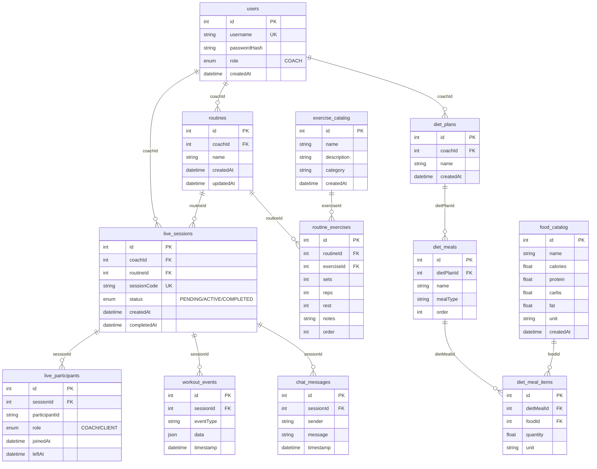

# Data Model Diagram

**Actualizado**: 2026-02-11 — Modelo completo solicitado por usuario, incluyendo tablas para expansiones futuras (dietas, catálogo de ejercicios, etc.). Tablas en negrita son core para MVP PRD. Tablas en cursiva son para expansiones post-MVP.

## Tablas y Campos

### **users**

- id (Int, PK)
- username (String, unique)
- passwordHash (String)
- role (Enum: COACH) — Solo coaches tienen auth en MVP
- createdAt (DateTime)

### _exercise_catalog_

- id (Int, PK)
- name (String)
- description (String?)
- category (String?) — e.g., "upper body", "cardio"
- createdAt (DateTime)

### **routines**

- id (Int, PK)
- coachId (Int, FK to users.id)
- name (String)
- createdAt (DateTime)
- updatedAt (DateTime)

### **routine_exercises**

- id (Int, PK)
- routineId (Int, FK to routines.id)
- exerciseId (Int, FK to exercise_catalog.id)
- sets (Int)
- reps (Int)
- rest (Int) — segundos
- notes (String?)
- order (Int) — para orden en rutina

### **live_sessions**

- id (Int, PK)
- coachId (Int, FK to users.id)
- routineId (Int, FK to routines.id)
- sessionCode (String, unique) — Código único para enlace compartido
- status (Enum: PENDING, ACTIVE, COMPLETED)
- createdAt (DateTime)
- completedAt (DateTime?) — Nullable

### **live_participants**

- id (Int, PK)
- sessionId (Int, FK to live_sessions.id)
- participantId (String) — UUID temporal para clients sin auth, o userId para coaches
- role (Enum: COACH, CLIENT)
- joinedAt (DateTime)
- leftAt (DateTime?) — Nullable

### **workout_events**

- id (Int, PK)
- sessionId (Int, FK to live_sessions.id)
- eventType (String) — e.g., "exercise:start", "set:completed"
- data (Json) — detalles del evento
- timestamp (DateTime)

### **chat_messages**

- id (Int, PK)
- sessionId (Int, FK to live_sessions.id)
- sender (String) — "COACH" o "CLIENT" + identifier
- message (String)
- timestamp (DateTime)

### _food_catalog_

- id (Int, PK)
- name (String)
- calories (Float)
- protein (Float)
- carbs (Float)
- fat (Float)
- unit (String) — e.g., "g", "ml"
- createdAt (DateTime)

### _diet_plans_

- id (Int, PK)
- coachId (Int, FK to users.id)
- name (String)
- createdAt (DateTime)

### _diet_meals_

- id (Int, PK)
- dietPlanId (Int, FK to diet_plans.id)
- name (String)
- mealType (String) — e.g., "breakfast", "lunch"
- order (Int)

### _diet_meal_items_

- id (Int, PK)
- dietMealId (Int, FK to diet_meals.id)
- foodId (Int, FK to food_catalog.id)
- quantity (Float)
- unit (String)

## Relaciones

- routines.coachId -> users.id
- routine_exercises.routineId -> routines.id
- routine_exercises.exerciseId -> exercise_catalog.id
- live_sessions.coachId -> users.id
- live_sessions.routineId -> routines.id
- live_participants.sessionId -> live_sessions.id
- workout_events.sessionId -> live_sessions.id
- chat_messages.sessionId -> live_sessions.id
- diet_plans.coachId -> users.id
- diet_meals.dietPlanId -> diet_plans.id
- diet_meal_items.dietMealId -> diet_meals.id
- diet_meal_items.foodId -> food_catalog.id

## Diagrama Mermaid

