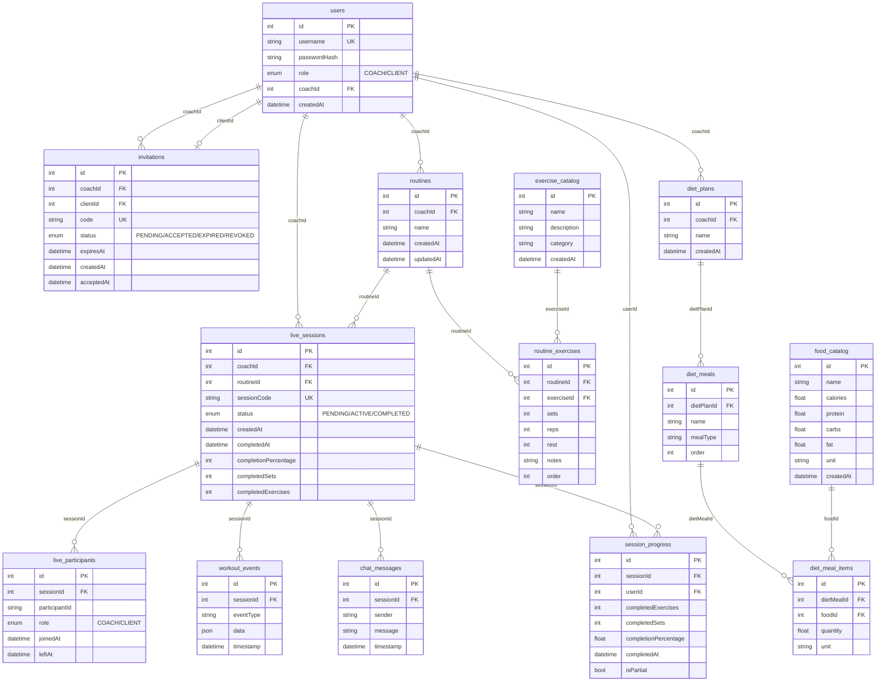

# Diagrama del Model de Dades

**Actualitzat**: 2026-05-08 — Afegida taula `session_progress` per persistir el progrés per usuari en Friend Sessions (LW-288). Les taules en **negreta** són bàsiques per al MVP. Les taules en *cursiva* són per a extensions post-MVP.

## Taules i Camps

### **users**

- id (Int, PK)
- username (String, unique)
- passwordHash (String)
- role (Enum: COACH, CLIENT)
- coachId (Int?, FK to users.id) — Per a clients assignats (s'omple en acceptar la invitació)
- createdAt (DateTime)

### **invitations**

- id (Int, PK)
- coachId (Int, FK to users.id) — Coach que genera la invitació
- clientId (Int?, FK to users.id) — S'omple en acceptar
- code (String, unique) — Token únic generat per invitació
- status (Enum: PENDING, ACCEPTED, EXPIRED, REVOKED)
- expiresAt (DateTime?) — Expiració opcional per invitació
- createdAt (DateTime)
- acceptedAt (DateTime?) — Moment d'acceptació

### *exercise_catalog*

- id (Int, PK)
- name (String)
- description (String?)
- category (String?) — p. ex. "upper body", "cardio"
- createdAt (DateTime)

### **routines**

- id (Int, PK)
- coachId (Int, FK to users.id)
- name (String)
- createdAt (DateTime)
- updatedAt (DateTime)

### **routine_exercises**

- id (Int, PK)
- routineId (Int, FK to routines.id)
- exerciseId (Int, FK to exercise_catalog.id)
- sets (Int)
- reps (Int)
- rest (Int) — segons
- notes (String?)
- order (Int) — per a l'ordre a la rutina

### **sessions**

- id (Int, PK)
- hostId (Int, FK to users.id)
- guestId (Int?, FK to users.id)
- code (String, unique) — Codi per a Friend Session
- status (Enum: ACTIVE, COMPLETED)
- createdAt (DateTime)
- timeout (DateTime)

### **live_participants**

- id (Int, PK)
- sessionId (Int, FK to live_sessions.id)
- participantId (String) — UUID temporal per a clients sense auth, o userId per a coaches
- role (Enum: COACH, CLIENT)
- joinedAt (DateTime)
- leftAt (DateTime?) — Nullable

### **workout_events**

- id (Int, PK)
- sessionId (Int, FK to live_sessions.id)
- eventType (String) — p. ex. "exercise:start", "set:completed"
- data (Json) — detalls de l'event
- timestamp (DateTime)

### **chat_messages**

- id (Int, PK)
- sessionId (Int, FK to live_sessions.id)
- sender (String) — "COACH" o "CLIENT" + identificador
- message (String)
- timestamp (DateTime)

### **session_progress** (LW-288)

- id (Int, PK)
- sessionId (Int, FK to live_sessions.id) — FK a la sessió
- userId (Int, FK to users.id) — Usuari que va completar el progrés
- completedExercises (Int) — Nombre d'exercicis completats
- completedSets (Int) — Nombre de sèries completades
- completionPercentage (Float) — Percentatge de progrés (0-100)
- completedAt (DateTime?) — Moment de finalització
- isPartial (Boolean) — true si la sessió va ser abandonada prematurament
- Únic: (sessionId, userId)

### *food_catalog*

- id (Int, PK)
- name (String)
- calories (Float)
- protein (Float)
- carbs (Float)
- fat (Float)
- unit (String) — p. ex. "g", "ml"
- createdAt (DateTime)

### *diet_plans*

- id (Int, PK)
- coachId (Int, FK to users.id)
- name (String)
- createdAt (DateTime)

### *diet_meals*

- id (Int, PK)
- dietPlanId (Int, FK to diet_plans.id)
- name (String)
- mealType (String) — p. ex. "breakfast", "lunch"
- order (Int)

### *diet_meal_items*

- id (Int, PK)
- dietMealId (Int, FK to diet_meals.id)
- foodId (Int, FK to food_catalog.id)
- quantity (Float)
- unit (String)

## Relacions

- invitations.coachId -> users.id
- invitations.clientId -> users.id (nullable, s'omple en acceptar)
- users.coachId -> users.id (relació coach→client, s'estableix en acceptar la invitació)
- routines.coachId -> users.id
- routine_exercises.routineId -> routines.id
- routine_exercises.exerciseId -> exercise_catalog.id
- live_sessions.coachId -> users.id
- live_sessions.routineId -> routines.id
- live_participants.sessionId -> live_sessions.id
- workout_events.sessionId -> live_sessions.id
- chat_messages.sessionId -> live_sessions.id
- session_progress.sessionId -> live_sessions.id (CASCADE)
- session_progress.userId -> users.id (CASCADE)
- diet_plans.coachId -> users.id
- diet_meals.dietPlanId -> diet_plans.id
- diet_meal_items.dietMealId -> diet_meals.id
- diet_meal_items.foodId -> food_catalog.id

## Diagrama Mermaid

```mermaid
erDiagram
    users ||--o{ invitations : coachId
    users ||--o| invitations : clientId
    users ||--o{ routines : coachId
    users ||--o{ live_sessions : coachId
    users ||--o{ diet_plans : coachId
    users ||--o{ session_progress : userId
    routines ||--o{ live_sessions : routineId
    routines ||--o{ routine_exercises : routineId
    exercise_catalog ||--o{ routine_exercises : exerciseId
    live_sessions ||--o{ live_participants : sessionId
    live_sessions ||--o{ workout_events : sessionId
    live_sessions ||--o{ chat_messages : sessionId
    live_sessions ||--o{ session_progress : sessionId
    diet_plans ||--o{ diet_meals : dietPlanId
    diet_meals ||--o{ diet_meal_items : dietMealId
    food_catalog ||--o{ diet_meal_items : foodId

    users {
        int id PK
        string username UK
        string passwordHash
        enum role "COACH/CLIENT"
        int coachId FK
        datetime createdAt
    }

    invitations {
        int id PK
        int coachId FK
        int clientId FK
        string code UK
        enum status "PENDING/ACCEPTED/EXPIRED/REVOKED"
        datetime expiresAt
        datetime createdAt
        datetime acceptedAt
    }

    exercise_catalog {
        int id PK
        string name
        string description
        string category
        datetime createdAt
    }

    routines {
        int id PK
        int coachId FK
        string name
        datetime createdAt
        datetime updatedAt
    }

    routine_exercises {
        int id PK
        int routineId FK
        int exerciseId FK
        int sets
        int reps
        int rest
        string notes
        int order
    }

    live_sessions {
        int id PK
        int coachId FK
        int routineId FK
        string sessionCode UK
        enum status "PENDING/ACTIVE/COMPLETED"
        datetime createdAt
        datetime completedAt
        int completionPercentage
        int completedSets
        int completedExercises
    }

    live_participants {
        int id PK
        int sessionId FK
        string participantId
        enum role "COACH/CLIENT"
        datetime joinedAt
        datetime leftAt
    }

    workout_events {
        int id PK
        int sessionId FK
        string eventType
        json data
        datetime timestamp
    }

    chat_messages {
        int id PK
        int sessionId FK
        string sender
        string message
        datetime timestamp
    }

    session_progress {
        int id PK
        int sessionId FK
        int userId FK
        int completedExercises
        int completedSets
        float completionPercentage
        datetime completedAt
        bool isPartial
    }

    food_catalog {
        int id PK
        string name
        float calories
        float protein
        float carbs
        float fat
        string unit
        datetime createdAt
    }

    diet_plans {
        int id PK
        int coachId FK
        string name
        datetime createdAt
    }

    diet_meals {
        int id PK
        int dietPlanId FK
        string name
        string mealType
        int order
    }

    diet_meal_items {
        int id PK
        int dietMealId FK
        int foodId FK
        float quantity
        string unit
    }
```
