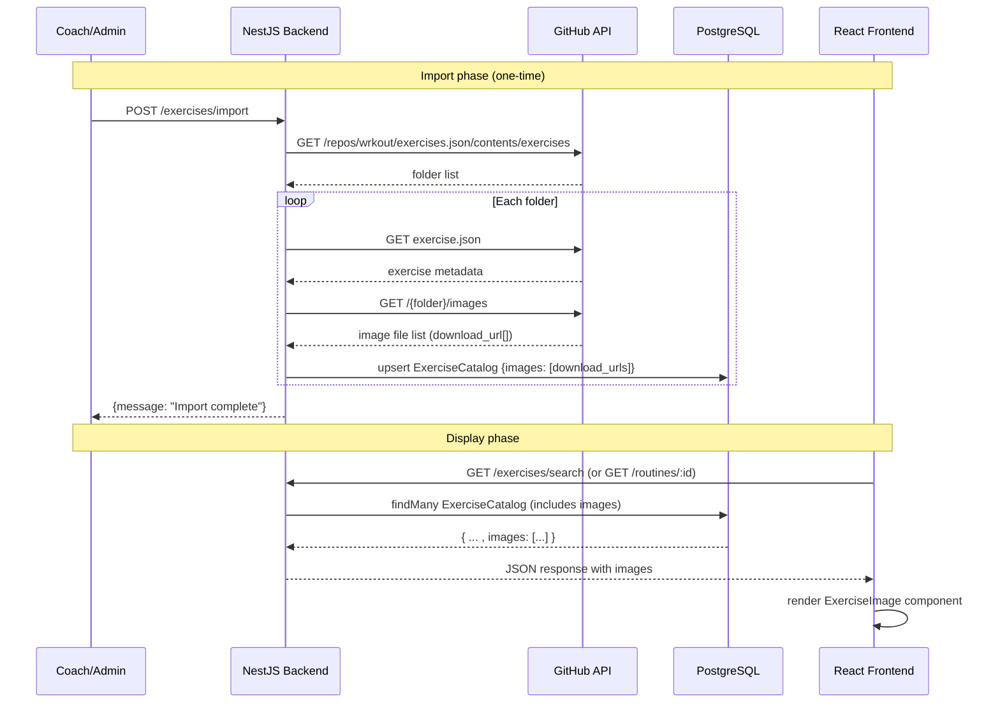

## Context

The exercise catalog (`ExerciseCatalog` model) stores metadata imported from `github.com/wrkout/exercises.json`. Each exercise folder in the GitHub repo can contain an `images/` directory with one or more images (0.jpg, 1.jpg, etc.) showing proper exercise form. The backend currently fetches these image URLs during `importAllExercises()` but does not persist them. The frontend has no image display capability.

```
Current flow           │  Target flow
                       │
exercises.service.ts   │  exercises.service.ts
  fetch images ──┐     │    fetch images ──┐
                 │     │                   │
  ...save to DB  │     │    save to DB ◄───┘
  (images: ❌)   │     │    images: String[]
                 │     │
                 ▼     │         ▼
  GET → no images      │    GET → "images": [...urls]
                       │         ▼
                       │    ExerciseImage component
                       │    ├─ ExerciseSearchModal detail
                       │    ├─ ExercisesForm card
                       │    └─ ActiveSession workout
```

## Goals / Non-Goals

**Goals:**
- Persist GitHub image `download_url`s in `ExerciseCatalog.images`
- Reusable `ExerciseImage` gallery component that renders 1+ images
- Integrate images alongside exercise instructions in all relevant views
- Graceful empty state: no images → render nothing (no placeholder)

**Non-Goals:**
- Uploading images manually (coach upload, drag-drop)
- CDN / local image storage — images are hot-linked from GitHub raw content
- Image processing (resize, crop, format conversion)
- Animated images or video

## Decisions

### 1. Prisma field: `images String[]`

Add a native Postgres array column to store GitHub download URLs. Postgres supports array columns natively, which is the simplest approach for this data shape.

```prisma
model ExerciseCatalog {
  // ...existing fields
  images           String[]          @default([])
  // ...existing relations
}
```

**Alternative considered**: JSON column. Rejected because PostgreSQL arrays are type-safe with Prisma and the data is homogenous (strings). JSON would add unnecessary complexity for querying.

**Migration**: `npx prisma migrate dev --name add_images_to_exercise_catalog`

### 2. Backend: save images during import

The import logic in `exercises.service.ts` already fetches image URLs in lines 56-71. Changes needed:

1. Uncomment and pass `images` to the upsert:
   - Add `images: imgUrl` to the `create` object
   - Add `images: imgUrl` to the `update` object
2. No other backend changes needed — Prisma auto-includes `images` in `findMany()` and `findUnique()` results

```typescript
// exercises.service.ts - upsert update object
update: {
  // ...existing fields
  images: imgUrl,        // ← add
},

create: {
  // ...existing fields  
  images: imgUrl,        // ← add
}
```

### 3. Frontend component: `ExerciseImage.tsx`

A dumb component that accepts `images: string[]` and renders a responsive gallery.

```
┌─────────────────────────────────┐
│  1 image: single large display  │
│  ┌─────────────────────────┐    │
│  │                         │    │
│  │         image           │    │
│  │                         │    │
│  └─────────────────────────┘    │
│                                 │
│  2+ images: side-by-side       │
│  ┌─────────┐ ┌─────────┐      │
│  │  img 1  │ │  img 2  │      │
│  └─────────┘ └─────────┘      │
│  ┌─────────┐ ┌─────────┐      │
│  │  img 3  │ │  img 4  │      │
│  └─────────┘ └─────────┘      │
│                                 │
│  No images: renders nothing    │
└─────────────────────────────────┘
```

**Props interface**:
```typescript
interface ExerciseImageProps {
  images: string[];
  className?: string;  // optional custom styling
}
```

**Behavior**:
- `images.length === 0`: return `null` (render nothing)
- `images.length === 1`: render single image at full width, centered
- `images.length >= 2`: render in responsive grid — `grid-cols-1 sm:grid-cols-2`
- Each `` uses `loading="lazy"` for lazy loading
- Each `` has `onError` handler that hides individual broken images
- Images use the GitHub raw URL directly (already `download_url` from API)
- Images are fully responsive: `w-full h-auto object-cover rounded-lg` with `max-h-96` to cap overly tall images

### 4. Integration points

```
ExerciseSearchModal (detail view)
  └─ Section: Instructions
       ├─ [NEW] ExerciseImage (images, size="md")
       └─ Existing: description text

ExercisesForm (exercise info card)
  └─ Section: exercise info box
       ├─ [NEW] ExerciseImage (images, size="md")
       └─ Existing: instructions text

ActiveSession (workout view)
  └─ Current exercise display
       ├─ Exercise name + set/rep info
       ├─ [NEW] ExerciseImage (images, size="lg")
       └─ Weight/reps inputs
```

### 5. Re-import strategy

After migration, trigger a full re-import by calling `POST /exercises/import`. The endpoint already handles upserts by exercise name, so it will:
- Fetch all exercise folders from GitHub
- Fetch and save image URLs for each
- Update existing rows (via `upsert` with `update` clause)
- No duplicate rows are created (name is unique)

### 6. Image source reliability

Images are hot-linked from `raw.githubusercontent.com`. Risks:
- GitHub raw URLs are stable but not guaranteed forever
- No control over image availability
- No caching layer (browser cache only)

Acceptable for MVP scope. Future improvement could proxy through the backend with local caching.

## Data flow diagram



## Risks / Trade-offs

| Risk | Mitigation |
|---|---|
| GitHub API rate limiting during import | Import is a rare admin action; if rate limited, retry with exponential backoff |
| GitHub raw URLs may change or become unavailable | Acceptable for MVP; future: proxy with local cache |
| Large images slow down page load | `loading="lazy"` on all images; images are GitHub's compressed originals |
| Broken image links show broken icon on screen | `onError` handler hides individual failed images silently |
| CORS issues with raw.githubusercontent.com | Public CDN, no CORS restrictions on raw.githubusercontent.com |

## Open Questions

- Should we add an image indicator (small thumbnail) in the search result list items too, or only in the detail view? The current scope puts images with instructions (detail level).
