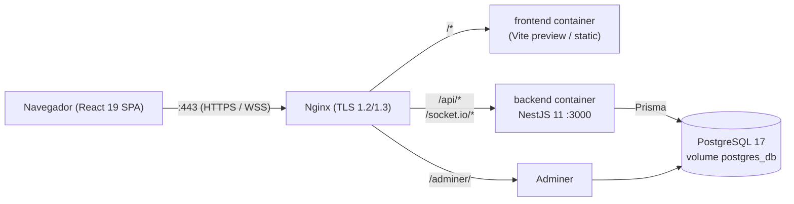
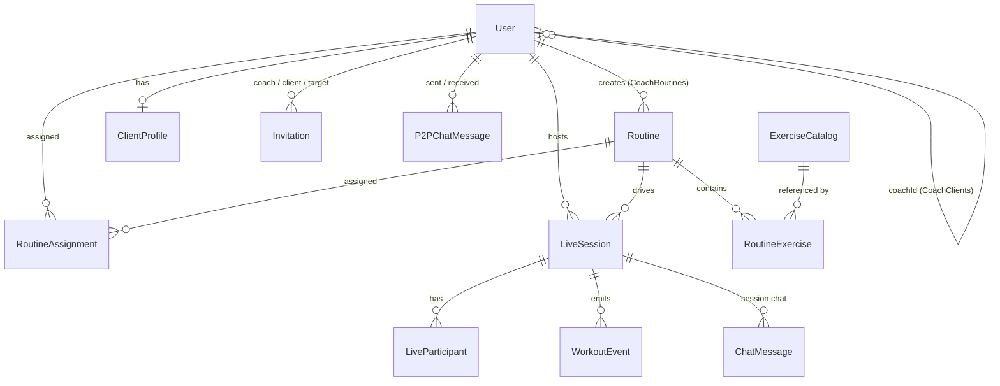

## Context

LightWeight is an MVP already in production. The codebase, the README and `doc/Proves_usuari.md` describe the system, but there is no machine-readable spec library — `openspec/specs/` is empty, so OpenSpec workflows (`/opsx:propose`, `/opsx:apply`, `/opsx:verify`) have nothing to compare against. This change documents the _current_ behaviour as the baseline.

This is a **documentation-only** change. No code under `src/back/` or `src/front/` is modified. The output is a set of `specs/<capability>/spec.md` files plus the updated `openspec/config.yaml` (already in place) and the three artefacts of this change.

Stakeholders: the four developers (Valeria, Amin, David, Bryan) who will use these specs as the input contract for every future change. Constraints: time-boxed (the team is small) — specs must be complete enough to verify against but cannot block on perfect coverage.

### Architectural baseline (what the specs describe)





> **Note:** `LiveParticipant`, `WorkoutEvent`, and `ChatMessage` exist in the Prisma schema but are **not populated at runtime**. The `RoomGateway` manages co-op session state in-memory only (a `Map<roomId, …>`). These models are schema scaffolding for a future persistence layer.



```mermaid
sequenceDiagram
    autonumber
    participant Caller as Caller (P2PChat)
    participant Server as EventsGateway
    participant Callee as Callee (AppContent)
    Caller->>Server: video-call-invite { callerId, calleeId, callerName, roomId }
    alt callee online
        Server-->>Caller: video-call-delivered
        Server->>Callee: video-call-invite
        Callee-->>Server: video-call-accept
        Server->>Caller: video-call-accept
        Caller->>Server: join-room { roomId }
        Callee->>Server: join-room { roomId }
        Caller-->>Callee: offer / answer / ice-candidate (relay)
        Note over Caller,Callee: Media flows P2P (UDP/TCP), STUN: stun.l.google.com:19302
    else callee offline
        Server-->>Caller: video-call-unavailable
    end
    opt timeout 30s or hangup
        Caller->>Server: video-call-end
        Server->>Callee: video-call-end
    end
```

## Goals / Non-Goals

**Goals:**

- Produce a complete, navigable spec library under `openspec/specs/` covering every capability listed in the proposal.
- Make every Socket.IO event currently emitted by the system explicit in a spec (so future renames or removals require a delta).
- Make role boundaries (Visitant / Coach / Client) explicit in every spec where access matters.
- Establish naming, structure and authoring conventions so the next developer knows exactly how to add or modify a spec.
- Unblock OpenSpec tooling: `openspec validate` should pass on the resulting library; `/opsx:propose` should be able to produce deltas against it.

**Non-Goals:**

- Adding, modifying, or removing any runtime behaviour. If the spec disagrees with the code, the **code** is the source of truth for this baseline change — the spec is rewritten to match it.
- Specifying post-MVP scaffolding present only in the Prisma schema (`DietPlan`, `DietMeal`, `DietMealItem`, `FoodCatalog`).
- Introducing a `shared/` workspace package or unifying the duplicated types between front and back.
- Adding a frontend test harness (Vitest, Testing-Library). It is recommended in `config.yaml` but its installation is its own change.
- Refactoring the Prisma schema to UUID PKs or to clean up the `events`/`session`/`room` module split.
- Writing user-facing documentation (the README already covers that audience). These specs are for developers and the OpenSpec workflow.

## Decisions

### D1. One spec file per capability, flat layout under `openspec/specs/`

Each capability listed in the proposal becomes `openspec/specs/<kebab-case>/spec.md`. No grouping by frontend/backend or by module — the spec is the user-visible contract, not the implementation layout.

**Alternatives considered:**

- _One spec per backend module._ Rejected: a capability like `video-call` spans `events` (signalling) and the frontend `chat` feature; splitting it by module hides the contract.
- _Single monolithic `spec.md`._ Rejected: future deltas need a stable target — small files are easier to diff and to validate independently.

**Rationale:** OpenSpec deltas operate per-capability. Flat layout matches OpenSpec conventions and keeps `openspec validate` happy.

### D2. Spec template

Every spec file follows this structure (so verification and review are uniform):

```markdown
# <Capability Name>

## Purpose

<1–3 sentences. Who uses it, why it exists.>

## Roles & Access

- Visitant: <allowed / blocked>
- Coach: <allowed / blocked, with which guard>
- Client: <allowed / blocked, with which guard>

## Domain Model

<Pointer to the Prisma entities involved + key fields. No re-derivation of the schema.>

## Interfaces

### REST endpoints

| Method | Path | Auth | Notes |
| ------ | ---- | ---- | ----- |

…

### Socket.IO events

| Direction | Event | Payload | Channel |
| --------- | ----- | ------- | ------- |

…

## Requirements

### REQ-<CAPABILITY>-<NN>: <short title>

GIVEN …
WHEN …
THEN …

## Testability

<At least one scenario: which Jest test exercises it, OR which manual-QA step from doc/Proves_usuari.md covers it, OR a documented Socket.IO test-client invocation.>

## Out of scope

<Anything adjacent that lives in another spec.>
```

**Alternatives considered:**

- _Free-form prose._ Rejected: GIVEN/WHEN/THEN is required by `config.yaml` rules and is what `openspec validate` expects.
- _Embedding DTOs verbatim._ Rejected: DTOs live in code (`src/back/src/<module>/dto/`); the spec links to them by file path. This avoids drift.

### D3. Socket.IO events are first-class spec content

Every realtime spec (`p2p-chat`, `coop-session`, `video-call`, `notifications`) includes a Socket.IO event table with: direction (Client→Server / Server→Client / Server→Room), payload shape, channel/room targeted, and the trigger condition. This is the surface most likely to break silently if not specced.

**Rationale:** The frontend Socket.IO singleton (`src/front/src/features/workout/services/socket.ts`) and the global listeners in `App.tsx` are the consumers of this contract. A rename in `EventsGateway` without a corresponding spec delta would be invisible to code review.

### D4. The spec is descriptive, not prescriptive — for the baseline only

Where the current implementation has rough edges (no automated frontend tests, duplicated types, tokens in localStorage), the spec **describes** the current behaviour and notes the gap in an "Out of scope" or "Known gaps" line. Future changes propose improvements as deltas.

**Rationale:** The proposal explicitly forbids behaviour changes. Smuggling improvements into the baseline would invalidate `/opsx:verify` against the running system.

### D5. Diagrams live in `design.md` of changes, not in specs

`spec.md` files reference Mermaid diagrams placed in `design.md` of the originating change. The baseline diagrams (architecture, ER, WebRTC sequence, co-op session sequence, chat sequence) live in **this** document and the specs link to it. Future changes embed their own diagrams in their own `design.md`.

**Alternatives considered:**

- _Diagrams in each spec._ Rejected: duplication, drift risk.
- _Separate `openspec/diagrams/` folder._ Rejected: out of OpenSpec convention.

### D6. Out-of-scope capabilities are explicitly listed, not omitted

`DietPlan`/`DietMeal`/`DietMealItem`/`FoodCatalog` exist in Prisma but are not implemented end-to-end. Rather than silently ignoring them, the spec library includes a top-level `openspec/specs/README.md` (single-purpose index) that lists "deferred capabilities". This prevents the next developer from thinking diet planning is implemented.

### D7. i18n and theming get their own specs (not just a footnote)

Both i18n and dark/light theming are user-visible behaviours that any future change can break. Specifying them protects against regressions and forces every UI-touching change to update the three locale files (config.yaml `tasks` rule already enforces this, but the spec gives it a verifiable home).

### D8. `infra-deploy` is a capability spec, not an appendix

Production deploy (Nginx config, Certbot, GitHub Actions deploy workflow) is treated as a versioned capability so that any change touching `nginx/`, `docker-compose.prod.yml`, or `.github/workflows/deploy.yml` produces a delta. This matches the `tasks` rule that requires a deploy-impact task whenever those files change.

## Reference: Socket.IO event matrix (baseline)

| Direction | Event                      | Payload (shape)                                                 | Channel              | Source                 |
| --------- | -------------------------- | --------------------------------------------------------------- | -------------------- | ---------------------- |
| C→S       | `register-user`            | `userId: number`                                                | direct               | EventsGateway          |
| C→S       | `open-chat`                | `{ userId, roomId }`                                            | direct               | EventsGateway          |
| C→S       | `close-chat`               | `{ userId, roomId }`                                            | direct               | EventsGateway          |
| C→S       | `get-chat-status`          | `{ roomId, otherUserId }`                                       | direct               | EventsGateway          |
| S→C       | `chat-partner-status`      | `{ roomId, status, otherUserConnected }`                        | direct               | EventsGateway          |
| S→C       | `chat-status`              | `{ roomId, status, otherUserConnected }`                        | direct               | EventsGateway          |
| C→S       | `send-p2p-message`         | `{ senderId, receiverId, text }`                                | direct               | EventsGateway          |
| S→C       | `p2p-message`              | `{ from, fromUsername, text, messageId, timestamp }`            | direct to recipient  | EventsGateway          |
| S→C       | `p2p-message-notification` | `{ from, fromUsername, text, messageId, timestamp }`            | direct to recipient  | EventsGateway          |
| C→S       | `join-room`                | `{ roomId }`                                                    | direct               | EventsGateway          |
| C→S       | `leave-room`               | `{ roomId }`                                                    | direct               | EventsGateway          |
| S→C       | `current-peers`            | `{ roomId, peers }`                                             | direct               | EventsGateway          |
| S→Room    | `user-joined`              | `{ socketId, roomId }`                                          | roomId               | EventsGateway          |
| S→Room    | `user-left`                | `{ socketId, roomId }`                                          | roomId               | EventsGateway          |
| C→S       | `offer`                    | `{ roomId, offer }`                                             | direct               | EventsGateway          |
| S→Room    | `offer`                    | SDP offer                                                       | room (except sender) | EventsGateway          |
| C→S       | `answer`                   | `{ roomId, answer }`                                            | direct               | EventsGateway          |
| S→Room    | `answer`                   | SDP answer                                                      | room (except sender) | EventsGateway          |
| C→S       | `ice-candidate`            | `{ roomId, candidate }`                                         | direct               | EventsGateway          |
| S→Room    | `ice-candidate`            | ICE candidate                                                   | room (except sender) | EventsGateway          |
| C→S       | `video-call-invite`        | `{ callerId, calleeId, callerName, roomId }`                    | direct               | EventsGateway          |
| S→C       | `video-call-delivered`     | `{ callerId, calleeId }`                                        | caller socket        | EventsGateway          |
| S→C       | `video-call-unavailable`   | `{ callerId, calleeId }`                                        | caller socket        | EventsGateway          |
| S→C       | `video-call-invite`        | `{ callerId, calleeId, callerName, roomId }`                    | callee socket        | EventsGateway          |
| C→S       | `video-call-accept`        | `{ callerId, calleeId, roomId }`                                | direct               | EventsGateway          |
| S→C       | `video-call-accept`        | `{ callerId, calleeId, roomId }`                                | caller socket        | EventsGateway          |
| C→S       | `video-call-reject`        | `{ callerId, calleeId }`                                        | direct               | EventsGateway          |
| S→C       | `video-call-reject`        | `{ callerId, calleeId }`                                        | caller socket        | EventsGateway          |
| C→S       | `video-call-end`           | `{ fromUserId, toUserId }`                                      | direct               | EventsGateway          |
| S→C       | `video-call-end`           | `{ fromUserId, toUserId }`                                      | target socket        | EventsGateway          |
| S→C       | `coach-invitation`         | `{ coachId, coachName, invitationCode, invitationId }`          | client socket        | EventsGateway          |
| C→S       | `joinRoom`                 | `{ roomId, userId, username, isHost }`                          | direct               | RoomGateway (/room ns) |
| S→C       | `joinedRoom`               | `{ isHost, usersInRoom }`                                       | direct               | RoomGateway            |
| S→Room    | `roomUsersUpdate`          | `{ usersInRoom }`                                               | roomId               | RoomGateway            |
| C→S       | `startSession`             | `{ roomId, routine }`                                           | direct               | RoomGateway            |
| S→Room    | `sessionStarting`          | `{ routine }`                                                   | roomId               | RoomGateway            |
| C→S       | `updateProgress`           | `{ roomId, userId, progressPercentage, completedExercises, … }` | direct               | RoomGateway            |
| S→Room    | `opponentProgressUpdate`   | same as updateProgress payload                                  | room (except sender) | RoomGateway            |
| C→S       | `leaveRoom`                | `{ roomId, userId }`                                            | direct               | RoomGateway            |
| S→Room    | `hostDisconnected`         | (empty)                                                         | roomId               | RoomGateway            |
| S→Room    | `guestDisconnected`        | (empty)                                                         | roomId               | RoomGateway            |

> The exact event names above are confirmed by `EventsGateway` and `RoomGateway` in `src/back/src/`. While writing each spec, the author MUST re-read the gateway file and update this matrix if any name diverges. The matrix is the single source of truth for the event surface.

## REST surface (baseline summary)

| Module      | Path prefix        | Notable endpoints                                                                                                                            |
| ----------- | ------------------ | -------------------------------------------------------------------------------------------------------------------------------------------- |
| auth        | `/api/auth`        | `POST /register`, `POST /login`, `GET /me`, `POST /forgot-password` (stub)                                                                   |
| routines    | `/api/routines`    | `GET /global`, `GET /clients-options`, `GET /my-routines`, `GET /`, `GET /:id`, `POST /create`, `PUT /:id/edit`, `DELETE /:id`               |
| exercises   | `/api/exercises`   | `GET /` (all), `GET /search` (filtered: search/level/category/force/mechanic/equipment/primaryMuscle/page/limit), `POST /import` (unguarded) |
| invitations | `/api/invitations` | `POST /` (create with optional expiresAt), `POST /:code/accept`, `PATCH /:id/reject`, `DELETE /:id` (revoke), `GET /pending-for-me`          |
| clients     | `/api/clients`     | `GET /` (coach's clients), `POST /invite-by-user`, `GET /me`, `GET /:id`, `PUT /:id`, `DELETE /me/unlink`, `DELETE /:id/unlink`              |
| session     | `/api/session`     | `GET /` (coach sessions), `GET /my-sessions` (client solo), `GET /:code` (public), `POST /create`, `POST /:code/status`                      |
| chat        | `/api/chat`        | `POST /send`, `GET /unread`, `POST /mark-read`, `GET /conversation/:userId`, `DELETE /:messageId`                                            |

> Each capability spec restates these for its scope only. The author MUST cross-check the exact route by reading the corresponding `*.controller.ts` file before writing the table — the summary above is a starting point, not the contract.

## Risks / Trade-offs

- **[Risk] Spec drift from code.** A spec that says "the system does X" while the code does Y is worse than no spec. → **Mitigation:** every spec is written by reading the live code and the README; the testability section pins each requirement to a Jest test or a manual-QA step that can be re-run; the verification task in `tasks.md` re-reads each gateway/controller before sign-off.
- **[Risk] Socket.IO event names in this design drift from gateway code.** → **Mitigation:** the event matrix in this document is the canonical reference; writing each realtime spec triggers a re-read of `EventsGateway`/`RoomGateway` and updates this matrix in the same commit.
- **[Risk] Effort sink.** Specifying 14 capabilities is significant work; the team may over-document. → **Mitigation:** the template caps each spec at the sections listed in D2; if a section is not applicable, the author writes "n/a" rather than expanding scope.
- **[Risk] Specs become out-of-date as soon as someone merges a behaviour change without going through OpenSpec.** → **Mitigation:** add a CONTRIBUTING-style note (in `tasks.md`'s deliverables) that links each PR template to the relevant spec; future enforcement (CI check that PRs touching `src/` reference an `openspec/changes/` directory) is out of scope here but is a logical follow-up.
- **[Trade-off] No automated frontend tests.** The testability scenarios for frontend-heavy capabilities (`chat`, `video-call`, `coop-session`) rely on manual QA today. Specs explicitly point at `doc/Proves_usuari.md` lines and flag the missing Vitest harness as a known gap.
- **[Trade-off] PKs are auto-increment Int, not UUID.** This was inherited from the existing schema and is documented as the convention; specs do **not** propose a migration. The `config.yaml` convention line warns future authors not to assume UUIDs.
- **[Risk] `events-debug.controller.ts` exposes debug endpoints.** Verify whether it is gated behind an environment flag or auth guard before specifying it; if open, flag as a security follow-up (do **not** silently document it as intentional).

## Migration Plan

This change has no runtime migration. The deploy plan is:

1. Land `openspec/config.yaml` and the three change artefacts on a feature branch.
2. Author each `openspec/specs/<capability>/spec.md` per the template in D2 (one commit per spec is recommended for review granularity, but a single squash-merge is acceptable since none of these affect runtime).
3. Run `openspec validate` locally; iterate until clean.
4. Open PR; reviewers spot-check three random specs against the live code.
5. Merge to `main`. Production redeploy is unaffected (no `src/` changes), but it will run because GitHub Actions triggers on every push to `main` — confirm the smoke check at https://lightweight.daw.inspedralbes.cat after deploy as per the Definition of Done.

**Rollback:** revert the merge commit. There is no schema/runtime impact, so rollback is purely a `git revert` of the spec/doc changes.

## Testing Strategy

- **What is tested:** the spec library itself.
- **Tools:** `openspec validate` (CLI) for structural correctness; manual review for content correctness.
- **No unit tests are added or removed** in this change. Each authored spec includes a _testability_ scenario pointing at:
  - an existing Jest test under `src/back/src/**/*.spec.ts` (today only `app.controller.spec.ts` exists; for most capabilities the testability scenario will explicitly say "no automated test today; manual QA step #N in `doc/Proves_usuari.md`"), OR
  - a manual-QA step in `doc/Proves_usuari.md`, OR
  - a recipe for invoking the relevant Socket.IO event with a test client (documented but not executed in CI).
- **Mocks called out** for future changes that will write tests against these specs:
  - `PrismaService` (mocked via `@nestjs/testing` provider override)
  - `Server` from `@nestjs/websockets` (spy on `to(room).emit`)
  - `getUserMedia` and `RTCPeerConnection` (replaced with stubs in the future Vitest setup for `chat`/`video-call` UI)

## Resolved Decisions (formerly Open Questions)

- **Q1 → Resolved.** `events-debug.controller.ts` is **omitted** from `infra-deploy` and flagged as a **security follow-up**. Action: a dedicated change SHALL audit whether the controller is authenticated/gated; if not, it must be removed or guarded before it is documented as intentional. The `infra-deploy` spec carries a "Known gap" requirement reflecting this.
- **Q2 → Resolved.** The password-reset flow does **not** currently send a recovery email — it is a UI stub. The `auth` spec describes the stub as the live behaviour and adds a "Known gap" line so a future change can introduce real email delivery without surprising readers.
- **Q3 → Resolved.** STUN servers are **hardcoded to Google STUN** (`stun.l.google.com:19302`) today. There is no env knob, no TURN server. The `video-call` spec documents the hardcoded value and the `infra-deploy` spec lists "configurable STUN/TURN" as a future improvement. A separate change will introduce env-driven STUN and an optional self-hosted TURN.
- **Q4 → Resolved.** `coach-clients-listing` is **merged into `client-profile`**. The `client-profile` capability covers both the list view (`GET /api/clients`) and the per-client detail/profile editing (`GET/PATCH /api/clients/:id` + private notes/goals). No separate `coach-clients-listing` spec exists.
- **Q5 → Resolved.** Tracking lives in **Jira** with hierarchy **Epic → US (User Story) → Tasks**. Every proposal SHALL link the Jira US (and parent Epic when relevant). The `proposal` rules in `openspec/config.yaml` are updated accordingly.
