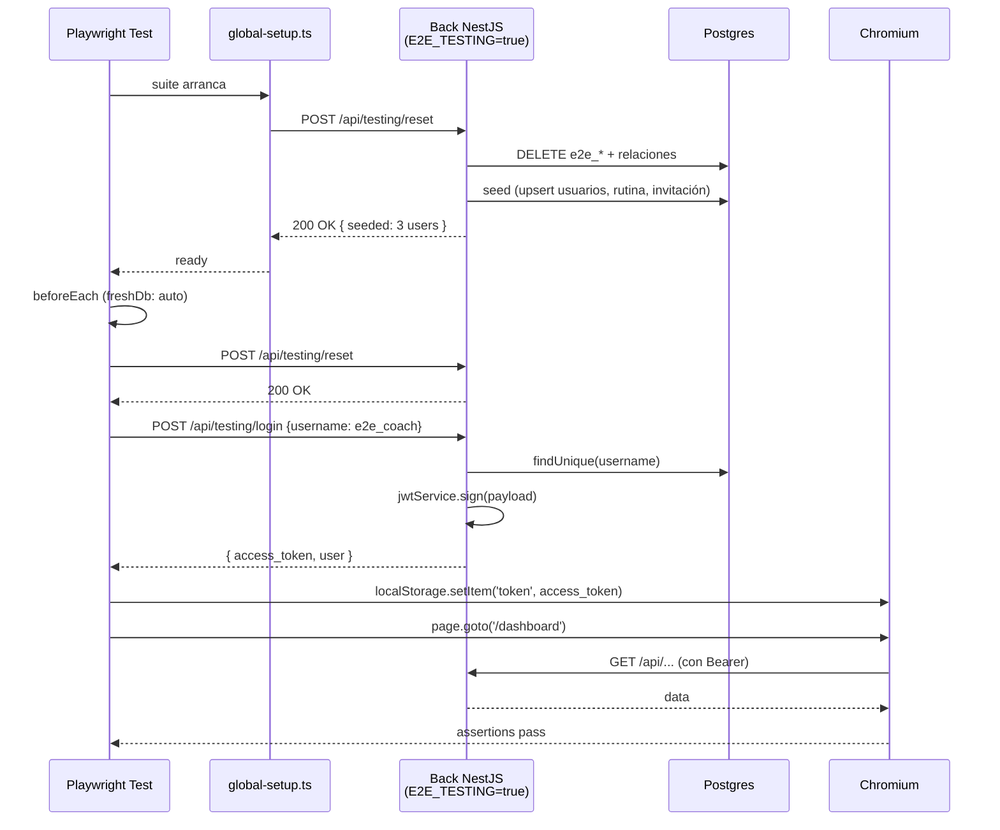
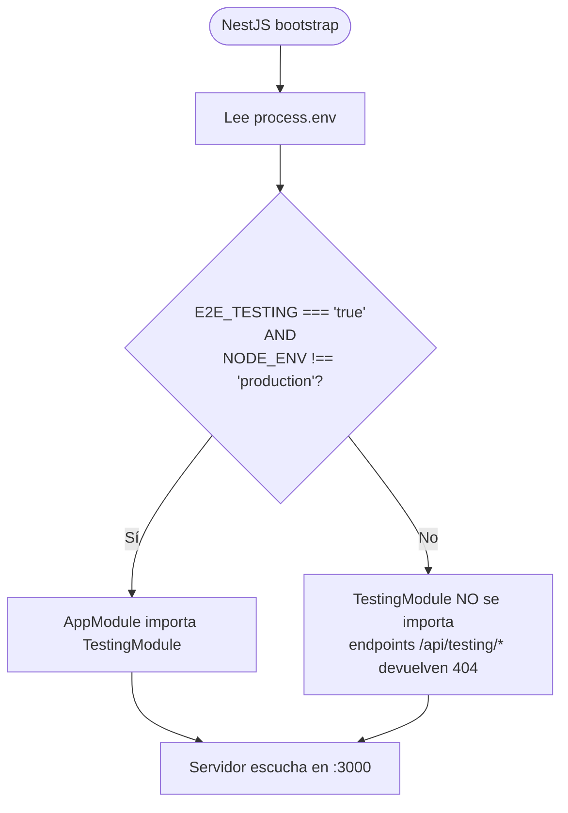

# Design — e2e-seed-data

> Tracking: épica **LW-436** · ticket **LW-440**.
>
> Esta entrega le pone una "DB de prueba reproducible" al harness de Playwright que dejó **LW-438**. Los tests por flujo (LW-441 / LW-442 / LW-443 / LW-444) consumirán las fixtures introducidas aquí; las decisiones de CI (LW-445) y de documentación de patrones (LW-446) viven fuera y solo se mencionan como follow-ups cuando ayudan a no pintar a este cambio en una esquina.

## Context

- LW-438 dejó `e2e/` instalado con un único `smoke.spec.ts` que solo asserta el `<title>` de la home. Ningún test toca aún la DB.
- Hoy `src/back/prisma/` tiene `schema.prisma` y `migrations/`, pero **no** existe `seed.ts` ni el campo `prisma.seed` en `package.json`. El `ExerciseCatalog` se rellena manualmente en dev.
- `src/back/src/auth/auth.service.ts` ya emite JWTs vía `JwtService.sign({ userId: user.id, role: user.role })`. La estrategia `JwtStrategy.validate()` espera ese mismo shape (`{ userId: number; role: string }`); cualquier divergencia rompe el guard.
- Convención del back: `req.user.userId` es el campo que la guard expone a los controllers (no `id`).
- No hay multi-tenant ni schemas separados en Postgres. Todos los entornos (dev / prod) comparten el mismo schema `public`. Los tests E2E correrán en local contra la misma DB de dev — por eso necesitamos prefijo y `fail-closed` en el módulo de testing.
- El back ya migró sus unit tests a Vitest (LW-432, archivado **2026-05-04-setup-vitest-backend**), así que el `*.spec.ts` del nuevo `TestingService` debe usar Vitest, no Jest.

## Goals / Non-Goals

**Goals:**

- Conjunto fijo y mínimo de usuarios E2E (`e2e_coach`, `e2e_client_linked`, `e2e_client_unlinked`) creado por un seed idempotente.
- Endpoint `POST /api/testing/reset` que devuelve la DB al estado seedeado en <2 s, **sin afectar datos de usuarios reales**.
- Endpoint `POST /api/testing/login` que entrega un JWT válido para un usuario `e2e_*` sin pasar por bcrypt+UI, para acelerar los tests por flujo.
- Fixtures Playwright (`loginViaApi`, `resetDatabase`) que cualquiera de LW-441/442/443/444 pueda importar como `import { test, expect } from '@/fixtures'`.
- **Fail-closed estricto** en producción: el módulo de testing nunca se carga si `NODE_ENV === 'production'`, ni siquiera con el flag forzado.

**Non-Goals:**

- DB dedicada o schema separado para E2E. Si más adelante hace falta, será otro cambio.
- Tests E2E por flujo (LW-441/442/443/444).
- Job de CI (LW-445).
- Documentación de patrones / Trace Viewer (LW-446).
- Seedear `LiveSession`, `P2PChatMessage`, `WorkoutEvent` u otros datos transaccionales — los tests por flujo los crean en su propio `beforeEach`.
- Rate-limit de `/api/testing/*` o auth de servicio: el módulo es público **solo cuando está activo**, y solo está activo en local con el flag `E2E_TESTING=true`.

## Decisions

### Decisión 1 — Estrategia de seed: Prisma `db seed` + `upsert`

**Decisión**: usar el mecanismo nativo de Prisma (`prisma.seed` en `package.json` apuntando a `ts-node prisma/seed.ts`) y hacer el seed idempotente con `upsert`.

| Opción | Pros | Contras |
|---|---|---|
| **Prisma `db seed` + `upsert` (elegida)** | Mecanismo oficial. `npx prisma db seed` se invoca desde cualquier sitio. `upsert` lo hace seguro de re-ejecutar. Mismo `PrismaClient` que el back. | Requiere `ts-node` como devDependency. |
| Endpoint REST que crea todo en cada run | Sin nuevo binario. Más explícito. | Más código. Reinventa lo que Prisma ya ofrece. |
| Fixtures SQL crudas (`psql -f seed.sql`) | Rápido. | Acoplado al schema bajo, se rompe en cada migración. |
| TestContainers + DB efímera | Aislamiento perfecto. | Requiere Docker en cada terminal de dev, latencia de arranque, y un cambio de infraestructura mucho mayor. Fuera de scope de LW-440. |

**Trade-off aceptado**: el seed comparte la DB de dev. La idempotencia (`upsert` por `username` único) y el prefijo `e2e_*` mitigan colisiones.

**Detalles de implementación** (ajustes pragmáticos descubiertos al ejecutar):

- **Comando real** en `package.json`: `ts-node --project prisma/tsconfig.seed.json prisma/seed.ts`. El `--compiler-options '{"module":"CommonJS"}'` inline rompe en `npm run` por el escapado JSON, así que se canaliza vía `prisma/tsconfig.seed.json` (un tsconfig dedicado con `module: CommonJS`, `strict: false` para permitir el script CLI).
- **Ubicación del código compartido**: la lógica del seed vive en `src/back/src/prisma/e2e-seed.ts` (exporta `seedE2EData(client)` + constantes `E2E_PASSWORD`, `E2E_INVITATION_CODE`). El `prisma/seed.ts` es un thin wrapper de ~15 líneas que crea un `PrismaClient` y delega. Razón: importar desde `prisma/` (fuera de `src/`) cambia el output de `nest build` (`dist/main.js` → `dist/src/main.js`) y rompe `start:prod`. Mantener todo lo importable bajo `src/` preserva la estructura del build.

### Decisión 2 — Endpoints de testing como módulo NestJS condicional

**Decisión**: nuevo módulo `TestingModule` en `src/back/src/testing/`, importado en `AppModule` solo si `process.env.E2E_TESTING === 'true' && process.env.NODE_ENV !== 'production'`.

```ts
// app.module.ts (extracto)
@Module({
  imports: [
    PrismaModule,
    AuthModule,
    // ... otros módulos ...
    ...(process.env.E2E_TESTING === 'true' &&
        process.env.NODE_ENV !== 'production'
          ? [TestingModule]
          : []),
  ],
})
export class AppModule {}
```

| Opción | Pros | Contras |
|---|---|---|
| **Módulo condicional en `AppModule` (elegida)** | Explícito y revisable en code review. Doble guarda (flag + NODE_ENV). Si alguien por error mete `E2E_TESTING=true` en prod, NODE_ENV=production lo bloquea igual. | Una rama condicional en `AppModule`. |
| Guard a nivel de controller (`@SetMetadata('e2e-only', true)`) | Más granular. | El controller existe siempre; un atacante podría descubrirlo. Peor postura de seguridad. |
| Build separado del back para E2E | Aislamiento total. | Duplica la pipeline. Demasiado para una capability de testing. |

### Decisión 3 — `POST /api/testing/login` en lugar de "saltarse" el guard JWT

**Decisión**: emitir el JWT vía `JwtService.sign(...)` reutilizando la lógica de `AuthService`, sin tocar bcrypt.

```ts
// testing.service.ts (extracto)
async loginAs(username: string) {
  if (!E2E_USERNAME_RE.test(username)) {
    throw new BadRequestException('username must match /^e2e_[a-z_]+$/');
  }
  const user = await this.prisma.user.findUnique({ where: { username } });
  if (!user) throw new NotFoundException(`User ${username} not found`);
  const access_token = await this.jwt.signAsync({
    userId: user.id,
    role: user.role,
  });
  return {
    access_token,
    user: { id: user.id, username: user.username, role: user.role, coachId: user.coachId ?? undefined },
  };
}
```

> **Nota sobre el payload**: el JWT lleva `{ userId, role }` (no `{ sub }`), porque ese es el shape que [auth.service.ts](../../../src/back/src/auth/auth.service.ts) ya emite y que `JwtStrategy.validate()` espera (`{ userId: number; role: string }`). Cualquier cambio futuro a esos campos debe coordinarse con `auth/`.

| Opción | Pros | Contras |
|---|---|---|
| **Reutilizar `JwtService.sign` (elegida)** | El payload es idéntico al que emite `/auth/login`. Cero divergencia con el flujo real. La frontend lo procesa igual. | Acopla `TestingService` a `JwtService` (deseable). |
| Saltarse el guard con un header `X-E2E-User` | Cero coste de cripto. | Divergencia con el flujo real, riesgo de que los tests pasen pero el flujo real no. Anti-patrón. |
| Hashear y crear el user en cada test | Muy realista. | Lento (bcrypt). Acumula usuarios si no se limpia. |

### Decisión 4 — Reset filtrado por convención de username (`e2e_*`)

**Decisión**: `POST /api/testing/reset` borra **únicamente** entidades cuyo `User.username` empieza por `e2e_` (más sus relaciones en cascada) y vuelve a aplicar el seed.

| Opción | Pros | Contras |
|---|---|---|
| **`DELETE WHERE username LIKE 'e2e_%'` + cascadas (elegida)** | No toca datos de usuarios reales en la DB de dev. Las cascadas ya configuradas (`ClientProfile → User`, `RoutineAssignment → User`, `P2PChatMessage → User`) limpian solas. | Requiere disciplina: cualquier dato seedeado fuera de un `e2e_*` no se limpia. |
| `TRUNCATE TABLE users CASCADE` | Reset perfecto. | Borra todo el dev. Inaceptable. |
| Schema separado de Postgres | Aislamiento total. | Cambio de infra fuera de scope. |
| Transacción que se hace rollback al final del test | Hermético. | Imposible cuando el test cruza HTTP/Socket.IO entre cliente y server (la transacción no abarca al cliente). |

**Cobertura de borrado** (orden importa; hay relaciones manuales sin cascade):

1. `Invitation` — borrar todas donde `coachId`, `clientId` o `targetClientId` apunten a un `e2e_*`.
2. `Routine` — borrar todas donde `coachId` apunta a un `e2e_*`. Las cascadas se llevan `RoutineExercise` y `RoutineAssignment`.
3. `User` — borrar usuarios `e2e_*`. Cascadas: `ClientProfile`, `P2PChatMessage`, `LiveSession`/`LiveParticipant`/`WorkoutEvent`/`ChatMessage` (todos los Cascade ya documentados en `AGENTS.md` §7).
4. Volver a llamar al seed → re-crea usuarios + rutina + asignación + invitación pendiente.

**Riesgo conocido**: el `ExerciseCatalog` no es por-usuario y no se borra. El seed lo hace `upsert`, así que puede convivir con catálogo real.

### Decisión 5 — Fixtures Playwright como `test.extend`

**Decisión**: `e2e/fixtures/index.ts` exporta un `test` extendido con `loginViaApi(role)` y `resetDatabase()`. Los tests futuros (LW-441/442/443/444) hacen `import { test, expect } from '../fixtures'` y consumen.

```ts
// e2e/fixtures/index.ts (esquema)
import { test as base, type Page } from '@playwright/test';
import { resetDatabase } from './reset';
import { loginViaApi } from './auth';
import { e2eUsers } from './users';

type Fixtures = {
  loginAs: (role: 'coach' | 'clientLinked' | 'clientUnlinked') => Promise<Page>;
  freshDb: void;
};

export const test = base.extend<Fixtures>({
  freshDb: [async ({}, use) => { await resetDatabase(); await use(); }, { auto: true }],
  loginAs: async ({ page }, use) => {
    await use(async (role) => {
      await loginViaApi(page, e2eUsers[role]);
      return page;
    });
  },
});
export { expect } from '@playwright/test';
```

**Trade-off**: `freshDb: { auto: true }` resetea **antes de cada test**. Es lo más simple y reproducible; cuando algún test futuro necesite un `describe.serial` que comparta estado, podrá `test.use({ freshDb: false })` puntualmente.

### Decisión 6 — Set fijo de tres usuarios

**Decisión**: tres usuarios cubren los escenarios mínimos:

| Username | Role | Vínculo | Cobre... |
|---|---|---|---|
| `e2e_coach` | COACH | — | LW-441 (login coach), LW-442 (rutinas), LW-443 (FriendSession host), LW-444 (invitaciones) |
| `e2e_client_linked` | CLIENT | `coachId = e2e_coach.id` | LW-441 (login client), LW-442 (cliente ve rutina asignada), LW-443 (FriendSession join) |
| `e2e_client_unlinked` | CLIENT | `coachId = null` | LW-444 (acepta invitación nueva) |

Password fija para los tres: `E2eP@ss123!` (cumple políticas si las hay; nunca saldrá de local).

| Opción | Pros | Contras |
|---|---|---|
| **3 usuarios fijos (elegida)** | Cubre el grafo mínimo (coach + linked + unlinked). Los tests pueden referirlos por nombre, sin generar randoms. | Si un flujo futuro necesita "coach con varios clientes", habrá que ampliar el seed o crearlos en el `beforeEach` del test. |
| Usuarios random por test | Aislamiento por test. | Reset y debug más costosos. Logs ilegibles. |
| Factory `createUser({...overrides})` | Flexible. | Reinventa Prisma. Innecesario para LW-440. |

### Decisión 7 — `globalSetup` que verifica el back, no que lo arranca

**Decisión**: `e2e/global-setup.ts` hace un `fetch(API_URL + '/testing/reset')` antes de la suite y falla rápido si el back no responde o no tiene el flag activo.

| Opción | Pros | Contras |
|---|---|---|
| **`globalSetup` que valida + resetea (elegida)** | El usuario ya arranca front+back manualmente (decisión heredada de LW-438). El setup solo dice "está listo o no". | Si el dev olvida `E2E_TESTING=true`, el setup falla con un error legible. |
| `webServer` en `playwright.config.ts` que arranque back+front | Un único comando. | Es el alcance de **LW-445** (CI). Aquí no se decide. |
| Sin `globalSetup` | Cero código. | Cada test paga el coste del primer reset y del descubrimiento del fallo. |

## Diagramas

### Flujo completo de un test E2E (a partir de LW-441)



### Carga condicional del módulo en AppModule



## Schemas y contratos

### Endpoint: `POST /api/testing/reset`

**Request**: body vacío.

**Response 200**:

```json
{
  "reset": true,
  "seeded": {
    "users": ["e2e_coach", "e2e_client_linked", "e2e_client_unlinked"],
    "routines": ["e2e_routine_basic"],
    "invitations": 1
  },
  "durationMs": 187
}
```

**Response 503** (cuando el módulo no está montado): el endpoint no existe → NestJS devuelve 404. Documentar esto en el README como "si veis 404 aquí, el back no tiene `E2E_TESTING=true`".

### Endpoint: `POST /api/testing/seed`

**Request**: body vacío. Ejecuta solo el seed (sin borrar). Útil para re-poblar `e2e_*` si un test los borra a mano.

**Response 200**: igual estructura que `/reset` pero sin la fase de delete.

### Endpoint: `POST /api/testing/login`

**Request DTO** (`src/back/src/testing/dto/login-as.dto.ts`):

```ts
import { IsString, Matches } from 'class-validator';

export class LoginAsDto {
  @IsString()
  @Matches(/^e2e_[a-z_]+$/, { message: 'username must match /^e2e_[a-z_]+$/' })
  username!: string;
}
```

**Response 200**:

```json
{
  "access_token": "eyJhbGciOi...",
  "user": {
    "id": 42,
    "username": "e2e_coach",
    "role": "COACH",
    "coachId": null
  }
}
```

**Response 400**: username no matchea `^e2e_*`.
**Response 404**: user no existe (alguien ha hecho reset y la fixture asume que estaba — se documenta como bug del test, no del módulo).

### Datos del seed

```ts
// src/back/prisma/seed.ts (esquema funcional)
const PASSWORD_HASH = await bcrypt.hash('E2eP@ss123!', 10);

// 1. Asegurar 5 ejercicios mínimos en el catálogo
await prisma.exerciseCatalog.upsert({ where: { name: 'Push-up' }, ... });
// (Pull-up, Squat, Bench Press, Deadlift)

// 2. Coach
const coach = await prisma.user.upsert({
  where: { username: 'e2e_coach' },
  update: {},
  create: {
    username: 'e2e_coach',
    email: 'e2e_coach@e2e.local',
    passwordHash: PASSWORD_HASH,
    role: 'COACH',
  },
});

// 3. Cliente vinculado
const clientLinked = await prisma.user.upsert({
  where: { username: 'e2e_client_linked' },
  update: { coachId: coach.id },
  create: {
    username: 'e2e_client_linked',
    email: 'e2e_client_linked@e2e.local',
    passwordHash: PASSWORD_HASH,
    role: 'CLIENT',
    coachId: coach.id,
    clientProfile: { create: { goals: 'E2E testing goals' } },
  },
});

// 4. Cliente sin coach
const clientUnlinked = await prisma.user.upsert({
  where: { username: 'e2e_client_unlinked' },
  update: {},
  create: {
    username: 'e2e_client_unlinked',
    email: 'e2e_client_unlinked@e2e.local',
    passwordHash: PASSWORD_HASH,
    role: 'CLIENT',
  },
});

// 5. Rutina del coach + 1 ejercicio
const routine = await prisma.routine.upsert({
  where: { /* compound (coachId, name) si existe; si no, findFirst + create */ },
  update: {},
  create: {
    coachId: coach.id,
    name: 'e2e_routine_basic',
    isPublic: false,
    exercises: {
      create: [{ exerciseId: pushUp.id, sets: 3, reps: 10, rest: 60, order: 0 }],
    },
    assignments: { create: [{ clientId: clientLinked.id }] },
  },
});

// 6. Invitación pendiente del coach hacia clientUnlinked
await prisma.invitation.upsert({
  where: { code: 'E2E-INVITE-001' },
  update: { status: 'PENDING' },
  create: {
    coachId: coach.id,
    targetClientId: clientUnlinked.id,
    code: 'E2E-INVITE-001',
    status: 'PENDING',
  },
});
```

> Nota: `Routine` no tiene unique por `(coachId, name)` hoy. El seed usa `findFirst({ where: { name: 'e2e_routine_basic', coachId } })` y crea solo si no existe, para mantener idempotencia sin migración.

## Estrategia de testing

| Capa | Framework | Qué se testea | Mocks |
|---|---|---|---|
| `TestingService` | **Vitest** (back, ya migrado en LW-432) | `loginAs` rechaza non-`e2e_*` (400). `loginAs` devuelve un JWT verificable con el mismo `JwtService`. `reset` no borra users sin prefijo. `seed` es idempotente (segunda llamada = mismas IDs). | `PrismaService` (in-memory mock por método), `JwtService` real. |
| `TestingController` | Vitest | El controller no se carga si el flag está apagado: test instancia `AppModule` con `E2E_TESTING=undefined` y hace `app.getHttpServer()` → `POST /testing/reset` devuelve 404. | Ninguno; Nest TestingModule. |
| Seed | Manual smoke + Vitest unit | `npx prisma db seed` corre dos veces seguidas sin error. Ambas dejan los mismos IDs. | DB de dev (test marcado `@integration`, opt-in). |
| Fixtures Playwright | E2E (Playwright) | Un test mínimo `e2e/tests/seed.spec.ts` hace `loginViaApi('coach') → resetDatabase() → loginViaApi('coach')` → asserta que el `access_token` cambia (porque user.id se mantiene pero `iat` es nuevo). | Front+back arrancados manualmente. |
| Manual QA | doc/Proves_usuari.md | Nueva entrada "E2E – datos de prueba": instrucciones para arrancar el back con el flag, correr el seed, verificar usuarios `e2e_*` en Adminer. | — |

**Lo que NO se testea aquí**:

- Flujos de login/rutinas/etc. → LW-441/442/443/444.
- Performance del reset bajo carga → si <2 s en local, suficiente para LW-440.
- Concurrencia de varios runs Playwright contra el mismo back → `playwright.config.ts` ya está en `workers: 1` por defecto en local; cuando llegue CI (LW-445) se decidirá si hace falta `database_url` por worker.

## Risks / Trade-offs

- **[Riesgo]** Alguien activa `E2E_TESTING=true` en producción.
  → **Mitigación**: doble guarda en `AppModule` (`E2E_TESTING=true` AND `NODE_ENV !== 'production'`). El secret `ENV_FILE` documenta explícitamente "no activar en prod" con un `# DO NOT SET IN PRODUCTION` arriba de la variable. CI futuro (LW-445) puede añadir un grep en el deploy step que rechace el deploy si el `ENV_FILE` lo contiene.

- **[Riesgo]** Un test deja datos `e2e_*` huérfanos (p.ej. crea `e2e_extra_user` y muere a mitad).
  → **Mitigación**: `reset` borra **todos** los users `e2e_*`, no solo los seedeados. La regla "todo lo que crees en un test debe llevar prefijo `e2e_`" se documenta en el README.

- **[Riesgo]** El `passwordHash` está hardcodeado en el seed; si alguien dumpea el repo y la DB de dev, conoce la contraseña.
  → **Mitigación**: la contraseña solo es válida para usuarios `e2e_*`, que solo existen en local. En el `.env.example` se documenta. En prod los users `e2e_*` no se crean nunca porque el seed se ejecuta solo manualmente y el flag está apagado.

- **[Trade-off]** Compartimos la DB de dev. Un dev que esté trabajando manualmente y haga `npm run test:e2e:browser` ve sus rutinas reales intactas (porque no llevan prefijo `e2e_`), pero **sus rutinas con nombre que empiece por `e2e_` sí se borran**. Aceptable; el prefijo `e2e_` es claramente "no humano".

- **[Trade-off]** El `globalSetup` aplica el seed una vez al arranque, y `freshDb: auto` lo aplica antes de cada test. Si la suite tiene 50 tests, son 51 resets. En local (DB con <100 filas) es <2 s cada uno → tolerable. Cuando llegue LW-445 con CI y carga real, se reevaluará si bajamos a `freshDb: { auto: false }` por defecto.

- **[Riesgo]** El `ExerciseCatalog` real está poblado con N filas en la DB de dev; el seed añade 5 con `upsert`. Si alguien renombra "Push-up" en el catálogo real, el seed lo "restaura". Al margen.

## Migration Plan

1. Code review del cambio entero (proposal + design + specs + tasks).
2. Merge a `main`.
3. En cada terminal de dev: `cd src/back && npm install` (instala `ts-node` nuevo) y `npx prisma db seed` (poblar la DB local con `e2e_*`).
4. Cada dev añade `E2E_TESTING=true` a su `.env` local (o no, si no quiere correr E2E).
5. **No requiere migración Prisma**. El seed solo usa modelos existentes.
6. **Rollback**: si el módulo de testing rompe algo, basta con un `E2E_TESTING=false` (o quitar la variable). El módulo se desmonta sin tocar la DB. Los users `e2e_*` quedan en la DB pero no estorban — un siguiente PR puede borrarlos a mano.

## Open Questions

- ¿`Routine` debería ganar un `@@unique([coachId, name])` para que el seed haga `upsert` directo en lugar de `findFirst+create`? **Decisión actual**: no, porque hoy la app permite a un coach tener dos rutinas con el mismo nombre; cambiar esto sería un cambio de comportamiento fuera de scope. El seed se conforma con la heurística `findFirst`.
- ¿Conviene exponer también `POST /api/testing/clear-cache` para flushear caches en memoria? **Decisión actual**: no hay caches significativos hoy en el back (no usamos `@nestjs/cache-manager`). Si llegan, se añadirá entonces.
- ¿Multi-DB para correr varios runs Playwright en paralelo en CI? Open hasta **LW-445**.
