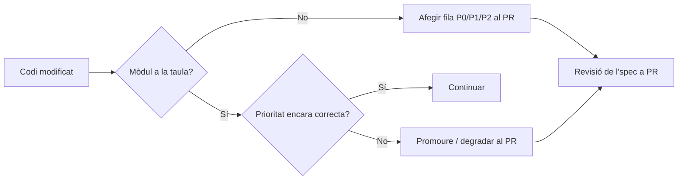

## Context

Els harnesses de tests unitaris ja existeixen: backend amb Vitest 4 + Oxc (`src/back/vitest.config.ts`) i frontend amb Vitest + jsdom + RTL (`src/front/vite.config.ts`). La cobertura actual és simbòlica (1 spec per package). LW-449 és la baula entre el harness i les tasques d'escriptura de tests reals: cal acordar i documentar quins mòduls es cobreixen primer perquè els properes tasques siguin executives, no de discussió.

L'aplicació té un perfil molt clar de risc:
- El realtime (Socket.IO + WebRTC) i les rutes JWT/role-guards són els punts on un bug és més car (sessió co-op trencada, vídeo no establert, accés indegut).
- L'ORM de Prisma està a tot arreu del backend; mockar `PrismaService` és el patró de test.
- El frontend té molta UI presentacional (baix valor de test) i unes poques peces amb lògica (interceptor axios, AuthContext, NotificationContext, socket singleton, càlcul d'estat de sessió).

Stakeholders: Valeria (autora del TFG, executora), professorat (avaluació). No hi ha equip QA dedicat; els tests són una xarxa de seguretat per a refactors al sprint final.

## Goals / Non-Goals

**Goals:**
- Produir una llista priorititzada (P0 / P1 / P2) de mòduls backend i features/utilitats frontend a cobrir amb tests unitaris.
- Justificar cada entrada amb tres eixos: risc, complexitat lògica i freqüència de canvi.
- Definir què queda explícitament fora (UI presentacional, controladors triviales, Prisma directe).
- Establir el procés de revisió: la llista és viva i s'ha de re-avaluar quan apareguin nous mòduls o un mòdul P2 passi a P0 per canvis significatius.
- Aprovar la llista (criteri d'acceptació de la US): la versió "aprovada" és la merge a `main` del fitxer `openspec/specs/unit-testing-priorities/spec.md`.

**Non-Goals:**
- Escriure cap test unitari (això són LW-450..LW-45x i posteriors).
- Modificar la configuració dels harnesses (LW-447/LW-448 ja completats).
- Definir cobertura E2E (gestionat per `e2e-testing` capability via Playwright).
- Definir un llindar de cobertura numèric (`%`) — el llindar és per US futures, no per aquesta tasca.
- Cobrir tests d'integració de Socket.IO o de gateway (és un treball a part, candidat a una capability `realtime-testing`).

## Decisions

### Decisió 1 — Estructura de la llista: taula amb columnes `Mòdul`, `Ruta`, `Prioritat`, `Justificació`, `Mocks/dependències`

**Alternativa A (acceptada)**: una sola taula per backend i una per frontend dins l'spec. Cada fila és un ítem prioritat (P0/P1/P2). La justificació és curta (1-2 línies) i menciona els tres eixos (risc/complexitat/freqüència).

**Alternativa B (rebutjada)**: tres llistes separades P0/P1/P2 sense taula. Rebutjada perquè perd les columnes de justificació i de dependències (mocks) — informació clau per a la persona que escriu el test.

**Alternativa C (rebutjada)**: graella ponderada (puntuació 1-5 per eix, suma → prioritat). Rebutjada per sobre-enginyeria; la mostra és petita i un judici expert documentat és suficient.

### Decisió 2 — Definició dels nivells de prioritat

- **P0 (cal cobrir abans de la propera release)**: lògica que pot deixar usuaris fora del sistema o causar pèrdua de dades / accés indegut. Inclou: `auth.service` (login, register, hash, JWT), guards de rol, `invitations.service` (codi únic, expiració), `routines.service` (assignació coach→client amb autorització), `clients.service` (visibilitat coach-only).
- **P1 (cobrir aquest sprint, post-P0)**: lògica complexa o amb branques múltiples on bugs degraden l'experiència però no comprometen seguretat. Inclou: `session.service` (transicions PENDING→ACTIVE→COMPLETED), `chat.service` (persistència + ordres), interceptor axios (refresh + 401 redirect), `AuthContext` (boot + logout), càlcul d'estat al frontend de la sessió co-op, `NotificationContext` (deduplicació).
- **P2 (a cobrir si hi ha temps abans del lliurament)**: utilitats pures, helpers, components amb una mica de lògica condicional. Inclou: helpers de validació de DTO no coberts a P0, components amb lògica de display condicional (ex. `RoutineCard`, `NotificationCenter`), helpers d'i18n.

### Decisió 3 — Què queda explícitament fora (no-test list)

Per evitar gastar temps en tests de baix valor, l'spec llista què NO es cobreix:
- Controllers NestJS que només deleguen al service (no aporten res sobre el service-test).
- Components React purament presentacionals sense lògica (ex. `Button`, `Card` simples).
- Pipes de Prisma o consultes directes (cobertes via tests d'integració, fora d'àmbit aquí).
- Migracions, configuració, `main.ts`.
- WebRTC end-to-end (només testem el codi de signalling al gateway si cal, no els peers).

### Decisió 4 — Procés de revisió

La llista NO és estàtica. Quan:
- es crea un mòdul nou → s'afegeix a la taula amb prioritat assignada al PR;
- canvia significativament un mòdul P2 (ex. ara gestiona pagaments) → es promou a P0/P1 al PR del canvi;
- un mòdul es deprecia → es retira de la taula al PR de retirada.

Per a aquest TFG, la revisió formal és anual (en revisions d'arquitectura) i puntual quan apareix una incidència.

### Decisió 5 — Output format: spec en català

Coherent amb la resta de specs del projecte (`backend-unit-testing`, `frontend-unit-testing`, `e2e-testing`), l'spec d'aquesta capability s'escriu en català, amb identificadors de codi i rutes en anglès.

## Risks / Trade-offs

- **Risc**: la priorització queda obsoleta sense rituals per actualitzar-la → **Mitigació**: un "scenario" de l'spec exigeix que tot PR que afegeix un mòdul nou actualitzi la taula; el procés és lleuger (afegir una fila).
- **Risc**: la llista es percep com a contracte rígid i frena la flexibilitat → **Mitigació**: l'spec deixa clar que P0 ≠ obligatori al PR del codi; només marca ordre. La cobertura concreta es decideix per US.
- **Trade-off**: documentar i justificar 25-30 mòduls afegeix esforç front-loaded; a canvi es desbloca treball paral·lel posterior i s'eviten discussions repetides a cada US de testing.
- **Risc**: judicis subjectius (què és "complexitat alta"?) → **Mitigació**: cada fila té un comentari de 1-2 línies; revisable a PR. No volem ponderació numèrica (vegeu Decisió 1 alt. C).

## Migration Plan

No aplica codi, només documentació. El "rollout" és el merge del fitxer spec a `main` un cop revisat i aprovat. Rollback: `git revert` del PR (sense efecte sobre cap part de l'app en runtime).

## Open Questions

- Volem afegir un threshold de cobertura (`%`) per CI? — Decidim que NO en aquesta US; queda obert per a una US futura un cop hi hagi tests reals escrits.
- L'spec hauria de viure dins `openspec/specs/` o a `doc/`? — Decidit: dins `openspec/specs/unit-testing-priorities/spec.md` per coherència amb les altres capabilities de testing.
