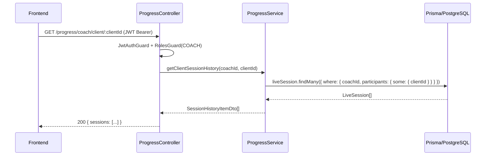

## Context

`LiveSession` is the central entity for workout sessions. It currently stores `status`, `completedAt`, and a relation to `Routine`. When a session finishes, `SessionService.updateSessionStatus` sets `status = COMPLETED` but no completion metrics (percentage, sets, exercises) are persisted. `WorkoutEvent` rows capture in-session events as untyped JSON, making reliable aggregation fragile.

The `progress` module must expose four read-only endpoints that aggregate this historical data for coaches (per-client view) and clients (own view). All data already exists in the DB; the only gap is missing summary fields on `LiveSession` and the service layer to query them.

## Goals / Non-Goals

**Goals:**
- New `ProgressModule` (`ProgressController` + `ProgressService`) under `src/back/src/progress/`
- Four GET endpoints with JWT + role guards
- Prisma schema additions: `completionPercentage`, `completedSets`, `completedExercises` on `LiveSession`
- Hook into `SessionService.updateSessionStatus` to persist those fields when status → COMPLETED
- Jest unit tests for `ProgressService`
- OpenAPI/Swagger documentation on all endpoints

**Non-Goals:**
- Frontend views (follow-up under LW-257)
- Mobile-specific endpoints
- Complex personal records (PRs), body metrics, or BI dashboards
- Paginated cursor-based navigation (simple offset is enough for MVP)

## Decisions

### 1. Persisted summary fields over query-time aggregation

**Decision**: Add `completionPercentage Int?`, `completedSets Int?`, `completedExercises Int?` to `LiveSession` and populate them when a session is marked COMPLETED.

**Alternatives considered**:
- *Query-time aggregation of `WorkoutEvent`*: avoids schema change but depends on consistent `eventType` naming across solo and co-op paths — currently not guaranteed. Also slow at scale.
- *Separate `SessionSummary` table*: over-engineered for MVP; a few nullable columns on `LiveSession` is sufficient.

**Why persisted fields**: Matches the Jira ticket requirement, is fast to query, and is deterministic. The payload data for completion is already available in the `room:complete` and solo session completion flows.

### 2. Single new module, reuse existing guards

**Decision**: Create `ProgressModule` as a standalone NestJS module that injects `PrismaService` directly (via import of `PrismaModule`). No dependency on `SessionModule` at the module level — `ProgressService` queries Prisma directly to avoid circular dependencies.

**Why**: Guards (`JwtAuthGuard`, `RolesGuard`) are already global or re-importable from `auth`. Querying Prisma directly in a new service is the established pattern in this codebase (see `ClientsService`, `ChatService`).

### 3. Coach can only see their own clients' sessions

**Decision**: `GET /progress/coach/clients` and `GET /progress/coach/client/:clientId` filter by `liveSession.coachId === req.user.id`. A coach cannot request data for a client that belongs to another coach.

**Why**: Enforces the data-ownership model. If `coachId` is null (solo session), that session is never returned by coach endpoints.

### 4. Client endpoint uses RoutineAssignment to find solo sessions

**Decision**: `GET /progress/client/sessions` returns sessions where `coachId IS NULL AND routine.assignments.some({ clientId: req.user.id })` — same filter as the existing `SessionService.getClientSessions`. Additionally includes co-op sessions where the client appears in `LiveParticipant` (as `participantId = String(userId)`).

**Why**: Clients can train in two modes (solo and co-op). Both should appear in their history.

### Prisma schema additions

```prisma
model LiveSession {
  // existing fields ...
  completionPercentage Int?  @map("completion_percentage")
  completedSets        Int?  @map("completed_sets")
  completedExercises   Int?  @map("completed_exercises")
}
```

Migration name: `add_completion_stats_to_live_sessions`

These fields are populated by the caller (frontend or RoomGateway) when sending the complete request. The `updateSessionStatus` endpoint (or a new `completeSession` endpoint) MUST accept an optional body with these values.

### API design

```
GET /progress/coach/clients
  → 200 { clients: [{ clientId, username, lastSessionAt, totalSessions }] }
  → 401 if no JWT
  → 403 if role !== COACH

GET /progress/coach/client/:clientId
  → 200 { sessions: [{ id, routineName, completedAt, completionPercentage, completedSets }] }
  → 401 / 403
  → 404 if clientId not one of this coach's clients

GET /progress/client/sessions
  → 200 { sessions: [{ id, routineName, completedAt, completionPercentage }] }
  → 401 if no JWT
  → 403 if role !== CLIENT

GET /progress/client/stats
  → 200 { totalSessions, totalSets, totalExercises }
  → 401 / 403
```

### DTO definitions (class-validator)

```ts
// coach-client-summary.dto.ts
export class CoachClientSummaryDto {
  clientId: number;
  username: string;
  lastSessionAt: Date | null;
  totalSessions: number;
}

// session-history-item.dto.ts
export class SessionHistoryItemDto {
  id: number;
  routineName: string;
  completedAt: Date | null;
  completionPercentage: number | null;
  completedSets: number | null;
}

// client-stats.dto.ts
export class ClientStatsDto {
  totalSessions: number;
  totalSets: number;
  totalExercises: number;
}
```

### Sequence diagram



## Risks / Trade-offs

- **`completedSets` / `completedExercises` are null for historic sessions** — data was not captured before this change. The frontend must handle `null` gracefully (show "N/A"). → Acceptable for MVP; backfill is out of scope.
- **`LiveParticipant.participantId` is a `String`** — for authenticated users it stores `String(userId)`, but for anonymous participants it may be a temporary UUID. Client-side history filters using `String(req.user.id)` which works for authenticated flows. → Verified in RoomGateway; anonymous participants are not expected in production.
- **Coach endpoint performance** — `getCoachClients` does a nested aggregate across `LiveSession`. With many clients and sessions this may be slow. → For MVP this is acceptable; add a DB index on `live_sessions.coach_id` if needed.

## Migration Plan

1. Add three nullable fields to `LiveSession` in `schema.prisma`
2. Run `npx prisma migrate dev --name add_completion_stats_to_live_sessions`
3. Deploy with `docker compose up -d --build` — migration runs automatically via `prisma migrate deploy` in the backend entrypoint
4. **Rollback**: the fields are nullable so removing them is a non-breaking migration; revert via a new `ALTER TABLE DROP COLUMN` migration
