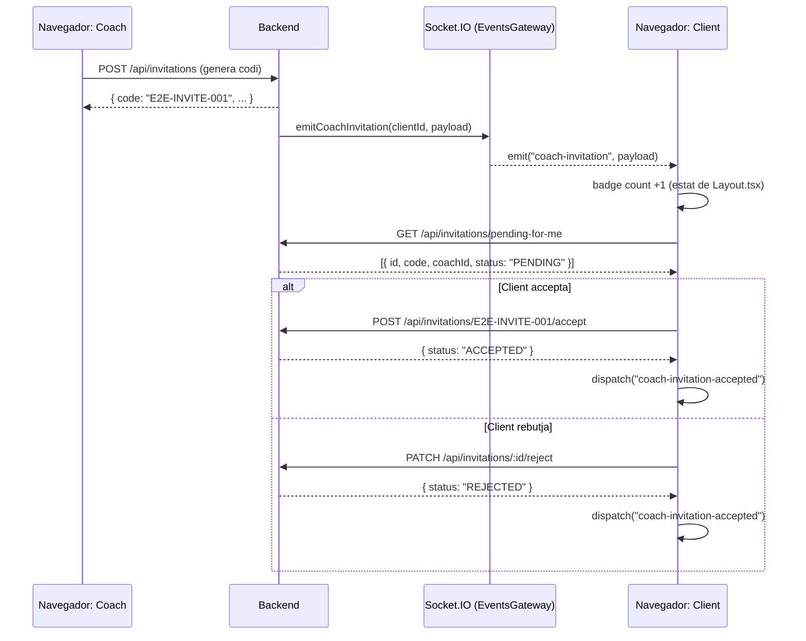

## Context

El flux d'invitacions abasta tres capes: API REST (`/api/invitations`), temps real via Socket.IO (event `coach-invitation`) i la interfície React (badge a `Layout.tsx` + llista a `ClientMyCoach.tsx`). El test E2E ha d'exercitar les tres en una sessió real de navegador, utilitzant el harness Playwright existent (workspace, fixtures, global setup, `POST /api/testing/reset`) introduït pel canvi d'infraestructura E2E previ.

Estat actual del harness:
- L'espai de treball `e2e/` ja existeix amb `@playwright/test`, `playwright.config.ts`, `e2e/global-setup.ts` i fixtures (`loginAs`, `freshDb`, `resetDatabase`).
- El seed proporciona `e2e_coach` i `e2e_client_unlinked` (no vinculat) més una `Invitation` pendent amb codi `E2E-INVITE-001` dirigida a `e2e_client_unlinked`.
- El mòdul de testing del backend (`POST /api/testing/reset`, `POST /api/testing/login`) es carrega condicionalment quan `E2E_TESTING=true`.

## Objectius / Fora d'abast

**Objectius:**
- Fitxer de tests Playwright que cobreixi: coach envia invitació → client rep badge de notificació en temps real → client accepta/rebutja → l'estat és consistent als dos costats.
- Usar dos contextos de navegador separats (coach i client) dins del mateix test per simular la interacció bidireccional.
- Afirmar l'efecte secundari de l'event Socket.IO `coach-invitation` (increment del badge a `Layout.tsx`) sense tocar el protocol WebSocket directament — verificar el comptador del badge al DOM.

**Fora d'abast:**
- Cap canvi al codi del backend ni del frontend.
- Cap nou fixture més enllà del que ja proporciona el harness.
- No es prova el flux de compartició de codi (`ClientJoinWithCode.tsx`).
- No es proven els estats d'expiració (`EXPIRED`) ni de revocació (`REVOKED`) de la invitació.

## Decisions

### Decisió 1: Dos contextos de navegador, no dues pàgines en un de sol

**Elecció**: Usar `browser.newContext()` dues vegades per crear sessions completament aïllades (`localStorage` i connexions Socket.IO separats).

**Per què**: El singleton Socket.IO (`features/workout/services/socket.ts`) es vincula una vegada per càrrega de pàgina. Dos objectes `page` dins del mateix context compartirien el singleton i interferirien entre ells. Un segon `BrowserContext` és la solució neta que reprodueix un escenari real de dos usuaris.

**Alternativa considerada**: Un únic context amb dues pàgines (pestanyes). Rebutjada perquè l'app React és una SPA que comparteix estat global (AuthContext llegeix `localStorage`, el singleton Socket.IO connecta en el moment de càrrega del mòdul). Dos contextos és l'enfocament idiomàtic de Playwright per a fluxos multi-usuari.

### Decisió 2: Verificar la notificació via badge del DOM, no per intercepció del socket

**Elecció**: Després que el coach envïa la invitació, el test espera que el badge de nav de la pàgina del client (`[data-testid="pending-invites-badge"]`) mostri un comptador `> 0`.

**Per què**: El badge el controla el handler `socket.on("coach-invitation", ...)` de `Layout.tsx` — afirmar-lo és un test d'integració de caixa negra que exercita el camí complet (REST → backend → Socket.IO → estat del frontend → DOM). Interceptar la trama WebSocket bruta seria fràgil i de caixa blanca.

**Alternativa considerada**: Fer polling de `GET /api/invitations/pending-for-me` des del test. Rebutjada perquè eludeix l'event Socket.IO i no detectaria una regressió on l'event deixés d'emetre's.

**Nota sobre `data-testid`**: Si l'element del badge a `Layout.tsx` no té ja un `data-testid`, el fitxer de tests usarà un selector de rol/text com a fallback i una tasca afegirà l'atribut.

### Decisió 3: Estat inicial basat en seed, reset entre tests

**Elecció**: Cada bloc `it` es recolza en `freshDb` (fixture automàtic) per reiniciar la BD a l'estat del seed determinista abans d'executar-se. La invitació pendent `E2E-INVITE-001` sempre es troba en estat `PENDING` al principi.

**Per què**: Els tests aïllats són resistents a l'ordre d'execució. El seed ja proporciona la precondició correcta (una invitació PENDING del coach a `e2e_client_unlinked`).

**Alternativa considerada**: Cada test crea la seva pròpia invitació via la interfície del coach. Rebutjada perquè afegeix passos de navegació que no estan sota prova, i faria del cas de prova "enviar invitació" l'única font de veritat per al valor del codi.

### Decisió 4: Acceptació i rebuig com a casos de prova separats

**Elecció**: Dos blocs `it` independents — un per a "client accepta" i un per a "client rebutja" — cadascun partint d'una BD neta.

**Per què**: Tots dos estats s'han de verificar de forma independent. Executar-los seqüencialment sobre una BD compartida requeriria gestió manual de l'estat dins del test.

## Diagrama de seqüència



## Estructura del fitxer de tests

```
e2e/tests/invitations.spec.ts
```

Tres casos de prova:

| Test | Precondició | Acció | Afirmació |
|---|---|---|---|
| `el coach envia una invitació i el client rep la notificació` | BD neta (seed: client no vinculat) | el coach navega a la pàgina d'invitació, genera un codi | el badge del client s'incrementa a ≥ 1 |
| `el client accepta la invitació` | BD neta + invitació PENDING (del seed) | el client navega a `/clients/my-coach`, clica Acceptar | la pàgina del client mostra el coach vinculat; la llista de clients del coach mostra el nou client |
| `el client rebutja la invitació` | BD neta + invitació PENDING (del seed) | el client navega a `/clients/my-coach`, clica Declinar | la invitació desapareix de la llista del client; la llista del coach no canvia |

## Riscos / Compromisos

- **Temporització del Socket.IO** → L'actualització del badge al DOM depèn que l'event `coach-invitation` arribi abans que s'executi l'afirmació. Mitigació: usar `page.waitForSelector('[data-testid="pending-invites-badge"]')` amb el timeout per defecte de Playwright (30 s) en lloc d'una espera fixa.
- **Manca de `data-testid`** → L'element del badge a `Layout.tsx` pot no tenir un `data-testid`. Si no en té, una tasca n'afegirà un; els tests usen un selector de text/rol com a fallback fins que s'afegeixi.
- **Tancament dels dos contextos** → Tots dos contextos s'han de tancar a `afterAll` per evitar connexions socket òrfenes. L'àmbit de context integrat de Playwright ho gestiona si els contextos es creen dins del fixture `browser`.
- **Inestabilitat a CI lent** → El round-trip de l'event Socket.IO afegeix latència. Els tests no han d'afirmar immediatament després de la crida REST — cal usar l'auto-espera de Playwright sobre canvis al DOM.

## Preguntes obertes

- El badge de `Layout.tsx` ja té un `data-testid`? Si no, cal afegir aquest atribut com a part d'aquest canvi (canvi d'una línia, risc zero).
- El test "el coach envia la invitació" ha de generar una NOVA invitació via la interfície (per cobrir també la UI d'enviament del coach), o recolzar-se en la del seed? Cobrir l'enviament via UI aporta més valor com a cobertura E2E real.
