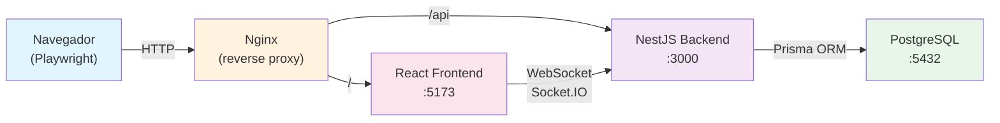
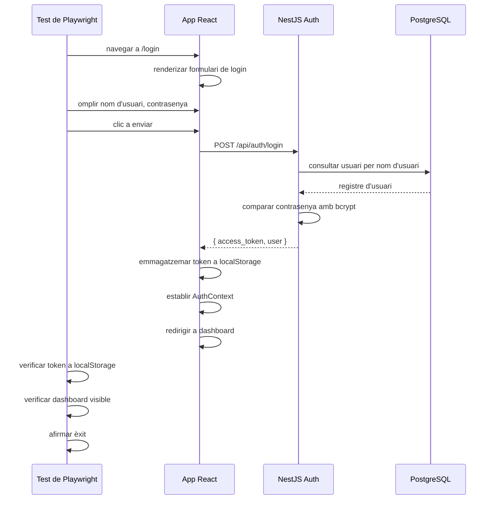

## Context

Actualment, els fluxos d'autenticació (registre, login, logout) tenen cobertura mínima de tests E2E. El fitxer `e2e/tests/auth.spec.ts` existent només conté una prova de seed i una prova de fum bàsica. La plataforma LightWeight utilitza autenticació basada en JWT amb emmagatzematge de tokens a `localStorage`, i qualsevol regressió en aquests fluxos impacta directament la capacitat de tots els usuaris per accedir a la plataforma.

Aquest disseny explica com construir tests E2E integral i mantenible per a tot el cicle de vida d'autenticació utilitzant Playwright, incloent models de pàgina, fixtures i asercions per a escenaris d'èxit i error.

## Objectius / No-Objectius

**Objectius:**
- Crear una capa de model de pàgina reutilitzable per a les pàgines Login i Register per millorar la mantenibilitat dels tests
- Escriure casos de tests E2E per: (1) registre exitós d'usuari, (2) login amb credencials vàlides, (3) login amb credencials invàlides i visualització de missatge d'error, (4) logout i invalidació de sessió, (5) persistència de sessió en recarregues de pàgina
- Aprofitar els fixtures de Playwright existents (auth, reset) i estendre-los amb nous ajudants per al registre d'usuaris
- Garantir que tots els tests passin consistentment en l'entorn local sense inestabilitat
- Documentar els patrons de tests i l'estructura per a futures proves de característiques

**No-Objectius:**
- Flux de restabliment de contrasenya (cobert per una especificació separada)
- Autenticació OAuth o tercers
- Autenticació multifactor (MFA)
- Signalling WebRTC durant autenticació (no aplicable)
- Tests unitaris per al servei/controlador Auth (els tests de backend són una especificació separada)

## Decisions

### 1. **Patró Page Model (vs selectores inline)**

**Decisió:** Utilitzar Page Model Objects (p. ex., `LoginPage`, `RegisterPage`) per encapsular selectores i accions.

**Justificació:**
- Redueix la duplicació de selectores entre fitxers de tests
- Quan la UI canvia, només un fitxer de model necessita actualitzar-se
- Els tests es fan més llegibles (`page.login.fillUsername()` vs. `page.locator('[data-testid="username"]').fill()`)
- S'alinea amb les millors pràctiques de Playwright per a mantenibilitat

**Alternativa considerada:** Selectores inline en cada test — rebutjada perquè acobla els tests a l'estructura HTML i fa la refactorització més difícil.

**Implementació:** Crear `e2e/fixtures/pages/LoginPage.ts` i `e2e/fixtures/pages/RegisterPage.ts` amb mètodes per a interaccions comunes:
```typescript
export class LoginPage {
  constructor(private page: Page) {}

  async fillUsername(username: string) {
    await this.page.locator('input[type="text"]').fill(username);
  }

  async fillPassword(password: string) {
    await this.page.locator('input[type="password"]').fill(password);
  }

  async clickSubmit() {
    await this.page.locator('button[type="submit"]').click();
  }

  async getErrorMessage() {
    return this.page.locator('[role="alert"]').textContent();
  }
}
```

### 2. **Gestió de Dades de Prova (fixture vs. sobre la marxa)**

**Decisió:** Utilitzar el fixture `auth` existent per gestionar usuaris precargats i estendre-lo amb un ajudant `registerNewUser()` per a tests de registre.

**Justificació:**
- Els usuaris precargats (via `e2e/fixtures/users.ts`) permeten tests de login ràpids
- Per a tests de registre, crear usuaris temporals dins del test i netejar-los via `reset.ts` després
- Evita la contaminació d'estat de base de dades i manté els tests independents

**Implementació:** Estendre `e2e/fixtures/auth.ts`:
```typescript
export const auth = defineConfig({
  async setup(context, use) {
    // Lògica de login existent...
    await use(authenticatedContext);
  },

  async registerNewUser(page, { username, email, password }) {
    // Cridar `POST /api/auth/register` i retornar { userId, token }
  },
});
```

### 3. **Estratègia de Prova de Persistència de Sessió**

**Decisió:** Prova el contingut de localStorage directament després del login, després verifica que sobrevieix a una recarregació de pàgina.

**Justificació:**
- localStorage és la font de veritat per a l'estat de sessió frontend a LightWeight
- AuthContext llegeix `localStorage` en el muntatge, de manera que verificar que el token persista valida tot el flux
- Cap cridada de backend necessària per validar — just execució JS

**Implementació:** Utilitzar `evaluate()` i `reload()` de Playwright:
```typescript
// Després del login
const token = await page.evaluate(() => localStorage.getItem('token'));
expect(token).toBeTruthy();

// Després de recarregar
await page.reload();
await page.waitForLoadState('networkidle');
const tokenAfterReload = await page.evaluate(() => localStorage.getItem('token'));
expect(tokenAfterReload).toBe(token);
```

### 4. **Manejo d'Errors i Asercions**

**Decisió:** Afirmar missatges d'error buscant elements `[role="alert"]` o notificacions toast (per estructura Tailwind/Flowbite).

**Justificació:**
- Frontend renderitza errors de forma consistent (toast o alerta inline)
- La localització per rol (`alert`, `status`) és més resilient que classes CSS
- Els tests capturen l'experiència real de l'usuari

**Alternativa:** Intercepció HTTP mock — rebutjada perquè prova la capa HTTP, no el comportament de la UI.

### 5. **Prevenció d'Inestabilitat**

**Decisió:** 
- Utilitzar esperes explícites (`waitForNavigation()`, `waitForLoadState('networkidle')`) en lloc de retards arbitraris
- Reintentar cridades de xarxa volàtils (login) una vegada abans de fallar
- Utilitzar `waitForSelector()` amb timeout abans de l'aserció

**Justificació:**
- Les esperes explícites garanteixen que l'app estigui en l'estat esperat abans de l'aserció
- Els reintentos compten amb hiccups de xarxa ocasionals en entorns locals
- Evita falsos negatius que frenan el desenvolupament

### 6. **Organització de Tests**

**Decisió:** Organitzar tests com a blocs `describe` separats: `Autenticació › Registre`, `Autenticació › Login`, `Autenticació › Logout`, `Autenticació › Persistència de Sessió`.

**Justificació:**
- Agrupació clara en la sortida del informe de tests
- Cada escenari és independent i pot executar-se en aïllament
- Més fàcil de paral·lelitzar en CI

## Riscos / Compensacions

| Risc | Mitigació |
|------|-----------|
| **Tests de login inestables** — Problemes de xarxa o timing causen falles intermitents | Utilitzar esperes explícites, lògica de reintent i `waitForLoadState('networkidle')` abans de les asercions. Validar token a localStorage abans de continuar. |
| **Noms d'usuari/contrasenyes hardcoded** — Dispersar strings màgics entre tests | Definir tots els usuaris de test a `e2e/fixtures/users.ts`. Fer-hi referència via constants (p. ex., `TEST_COACH_USERNAME`). |
| **Fuga d'estat de base de dades** — Les dades del test anterior afecten el test següent | Cridar reinici del fixture `reset.ts` a `afterEach()`. Assegurar-se que cada test de registre utilitza un nom d'usuari únic (suffix de timestamp + aleatori). |
| **Canvis de text de UI trenquen tests** — Canvis futures de i18n o actualitzacions de copia trenquen asercions | Utilitzar selectores `[role="alert"]` en lloc de hardcoding de text d'error. Validar *presència* de missatge en lloc de redacció exacta. |
| **Inflació del page model** — Els page models es tornen massa grans i impossibles de mantenir | Mantenir els page models enfocats en una sola pàgina. Crear model separat per a cada pàgina diferent (LoginPage, RegisterPage). Evitar lògica de negoci en models. |
| **Execució de tests lenta** — Tots els tests executen-se serialmente i triguen massa localment | Els tests ja són paral·lelitzables a Playwright. Executar `playwright test --workers=4` per a comentaris més ràpids. |

## Estratègia de Prova

### Què es Prova

1. **Flux de Registre**
   - Omplir nom d'usuari, correu electrònic, contrasenya, confirmació de contrasenya
   - Enviar formulari
   - Verificar redirecció al dashboard o pàgina de login per rol
   - Verificar token emmagatzemat a localStorage

2. **Login — Credencials Vàlides**
   - Omplir nom d'usuari, contrasenya
   - Enviar
   - Verificar redirecció al dashboard correcte per rol (entrenador o client)
   - Verificar token JWT a localStorage

3. **Login — Credencials Invàlides**
   - Omplir nom d'usuari, contrasenya incorrecta
   - Verificar visualització del missatge d'alerta d'error
   - Verificar que no hi ha token emmagatzemat a localStorage
   - Verificar que l'usuari roman a la pàgina de login

4. **Logout**
   - Login primer, verificar autenticació
   - Clic al botó de logout
   - Verificar localStorage netejat
   - Verificar redirecció a pàgina de login
   - Verificar que no es pot accedir a rutes protegides sense re-login

5. **Persistència de Sessió**
   - Login, verificar token a localStorage
   - Recarregar pàgina
   - Verificar token encara a localStorage
   - Verificar que l'usuari segueix autenticat (navbar mostra info d'usuari)

### Framework de Prova

- **Eina:** Playwright 1.45+ (ja configurat a `playwright.config.ts`)
- **Biblioteca d'asercions:** `expect()` incorporat de Playwright
- **Fixtures:** `e2e/fixtures/auth.ts` estès amb ajudant de registre

### Què es Mockeja / No es Mockeja

| Component | Mockejat? | Raó |
|-----------|-----------|-----|
| Endpoints d'auth de backend (`POST /auth/register`, `POST /auth/login`) | No — cridades API reals | Els tests validen el flux end-to-end incloent backend |
| Base de dades PostgreSQL | No — BD real | Utilitza dades de seed existents + noves entrades creades durant tests de registre |
| Socket.IO | No — connexió real | Playwright es connecta al backend real; tests només d'auth (sense events realtime disparat) |
| localStorage | No — API real del navegador | Validem localStorage per assegurar persistència |
| Interceptor HTTP (axios) | No — client axios real | Part del flux que es prova |

### Execució de Tests i CI

- **Local:** `npm run test:e2e` a l'arrel de l'espai de treball (executa tots els tests E2E)
- **Test específic:** `npm run test:e2e -- auth.spec.ts`
- **CI:** GitHub Actions executa tests E2E després que passin els tests unitaris (`.github/workflows/deploy.yml`)
- **Paral·lelització:** `playwright.config.ts` estableix `workers: 2` (pot augmentar-se localment per a comentaris més ràpids)

## Diagrama d'Arquitectura



## Flux d'Execució de Tests



## Configuració de Playwright

No es requereixen canvis a `playwright.config.ts`; els paràmetres existents suporten aquests tests:
- URL Base: `http://localhost:5173` (servidor de dev de frontend)
- Timeout: 30 segons per test
- Reintentos: 0 localment, 2 a CI
- Workers: 2 (pot augmentar-se)

## Asercions de i18n i Tests

Tots els missatges visibles per a l'usuari (alertes d'error, notificacions toast) ja estan a `src/front/src/i18n/locales/{ca,es,en}.json`:

| Clau | Català | Espanyol | Anglès |
|-----|---------|---------|---------|
| `auth.register.title` | Registrar-se | Registrarse | Register |
| `auth.register.success` | Registre exitós | Registro exitoso | Registration successful |
| `auth.login.error` | Credencials incorrectes | Credenciales incorrectas | Invalid credentials |
| `common.logout` | Tancar sessió | Cerrar sesión | Logout |

Els tests afirmen la presència de text localitzat segons l'idioma del navegador (Català per defecte en tests).

## Deploy i Rollout

**Canvis de backend:** Cap — els tests no modifiquen endpoints d'auth.

**Canvis de frontend:** Cap — els tests no afegeixen característiques, només cobertura E2E.

**Fitxers de test E2E:** 
- Nous casos de test afegits a `e2e/tests/auth.spec.ts`
- Nous page models: `e2e/fixtures/pages/LoginPage.ts`, `e2e/fixtures/pages/RegisterPage.ts`
- Fixture estès: `e2e/fixtures/auth.ts` (nou ajudant `registerNewUser()`)

**Impacte CI:** 
- Els tests E2E s'executen després de la construcció exitosa i els tests unitaris
- Si E2E falla, la construcció es marca com a fallida i el PR no pot fusionar-se
- No rollback necessari (els tests no són codi de producció)

## Preguntes Obertes

1. Hauríem de provar el registre per a ambdós rols (COACH i CLIENT), o només un? → Asumir ambdós; l'assignació de rol de backend és automàtica basada en invitació.
2. Hauríem de provar el text de la UI en tots els tres idiomes (ca, es, en), o només en català? → Començar amb català (per defecte); pot estendre's més tard segons és necessari.
3. Hauríem de provar escenaris de timeout (p. ex., 30s sense resposta del backend)? → Diferir a una especificació separada "error resilience"; enfocarse en ruta feliç + errors de validació primer.
