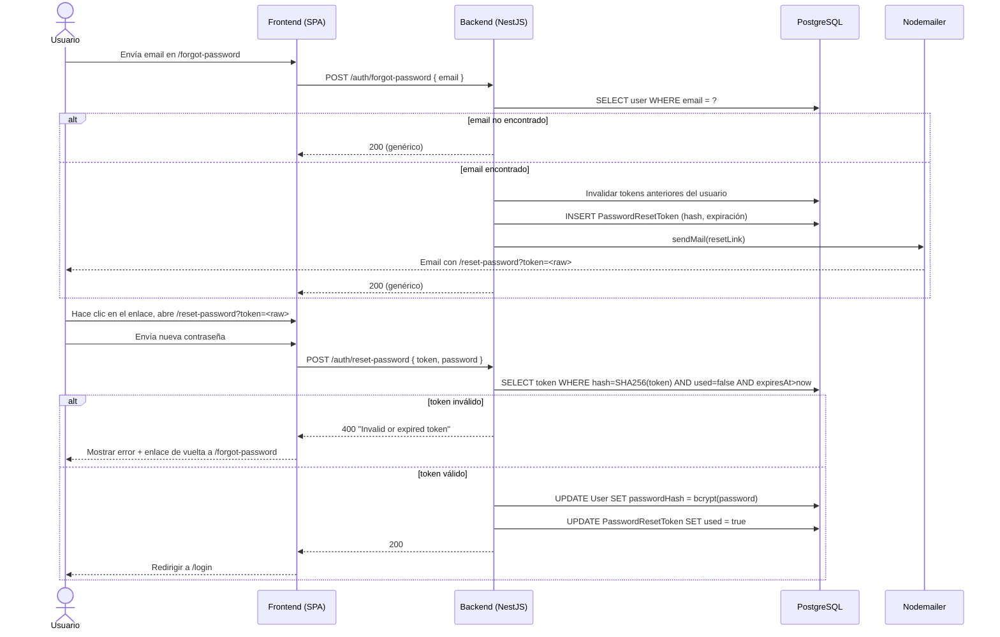

## Contexto

La página `ForgotPassword` en `/forgot-password` actualmente simula el flujo de restablecimiento — no llama a ningún endpoint del backend y muestra un toast de éxito sin importar qué. El módulo `auth` no tiene endpoints de restablecimiento, ni modelo de token, ni integración de email. Este diseño reemplaza el stub con un flujo real y seguro para producción.

**Estado actual:**
- `src/back/src/auth/` — solo `register` + `login`; sin endpoints de restablecimiento.
- `src/front/src/features/auth/pages/ForgotPassword.tsx` — stub (sin llamada a la API).
- Sin modelo `PasswordResetToken` en el schema de Prisma.
- Sin librería de email en `src/back/package.json`.

**Restricciones:**
- No debe revelar si un email existe en la base de datos (siempre responder 200 a las peticiones de forgot-password).
- El token debe ser de un solo uso y expirar tras 30 minutos.
- Se requiere Gmail OAuth2 en producción (las App Passwords están desactivadas en la cuenta org); Ethereal Email se usa en local — sin servicio Docker adicional.
- El rate limiting debe proteger el endpoint `forgot-password` contra abusos.

## Objetivos / No objetivos

**Objetivos:**
- Añadir `POST /auth/forgot-password` y `POST /auth/reset-password` al módulo `auth` de NestJS.
- Añadir el modelo Prisma `PasswordResetToken` y la migración.
- Crear `MailModule` / `MailService` que envuelva Nodemailer (Gmail OAuth2 en prod, Ethereal en dev).
- Reemplazar el stub de ForgotPassword y añadir una nueva página ResetPassword en la SPA.
- Añadir claves i18n (en/es/ca) para todos los nuevos textos de UI.
- Respetar el patrón existente: módulos NestJS, Prisma, axios, React Context, i18next.

**No objetivos:**
- Cambio de contraseña para usuarios autenticados (historia separada).
- Recuperación por SMS/OTP.
- Login social (Google OAuth para identidad — epic separado).
- Motor de plantillas de email (HTML plano en string es suficiente para el MVP).
- Implementación de tests unitarios/E2E (rastreados en LW-454).

## Decisiones

### 1. Transporte de email: Nodemailer con Gmail OAuth2 (prod) vs Ethereal (dev)

**Decisión:** Una sola clase `MailService` con el transporte seleccionado según `NODE_ENV`.
- `NODE_ENV=production` → transporte Gmail OAuth2 via `nodemailer.createTransport({ service: 'gmail', auth: { type: 'OAuth2', user, clientId, clientSecret, refreshToken } })`.
- Cualquier otro entorno → `nodemailer.createTestAccount()` (Ethereal), loguear la URL de previsualización en consola.

**¿Por qué no Mailhog?** Ethereal no requiere ningún cambio en Docker — sin nuevo servicio en `docker-compose.yml`. La URL de previsualización de Ethereal se loguea en stdout, lo cual es suficiente para verificación en dev/test. Mailhog requeriría añadir un servicio y configurar `SMTP_HOST`; Ethereal es autocontenido.

**¿Por qué no Resend?** El ticket de Jira indica explícitamente Gmail OAuth2 como opción de producción. Resend añadiría una dependencia externa de pago. Gmail OAuth2 es gratuito y ya está disponible a través del Google Workspace del proyecto.

**Alternativas consideradas:**
- Gmail App Password: desactivado en cuentas org; OAuth2 es el enfoque correcto.
- Resend SDK: API más sencilla pero introduce un servicio de pago externo sin equivalente local.

### 2. Almacenamiento del token: hash en BD, token en bruto en el enlace

**Decisión:** `crypto.randomBytes(32)` genera el token en bruto → hash SHA-256 almacenado en `PasswordResetToken.token` → token hex en bruto enviado en la URL del enlace de restablecimiento.

En `reset-password`, el backend hashea el token en bruto recibido y lo compara contra la BD. Esto significa que una brecha de base de datos nunca expone enlaces de restablecimiento utilizables.

### 3. `MailModule` como módulo NestJS separado

**Decisión:** `src/back/src/mail/mail.module.ts` con `MailService` exportado; `AuthModule` importa `MailModule`.

Esto mantiene `AuthService` testeable: los tests proporcionan un mock de `MailService` via `overrideProvider` de `@nestjs/testing`. El módulo usa un token de proveedor personalizado `MAIL_SERVICE` para facilitar la sustitución por mock.

**¿Por qué no incluir Nodemailer directamente en `AuthService`?** Acoplaría la configuración SMTP a la lógica de auth y haría que los tests unitarios requirieran un servidor SMTP real o un mocking complejo.

### 4. Rate limiting via `@nestjs/throttler`

**Decisión:** Aplicar `ThrottlerGuard` globalmente en `AppModule` con un TTL corto en `POST /auth/forgot-password`. El endpoint usará `@Throttle({ default: { limit: 3, ttl: 60000 } })` (3 peticiones por minuto por IP).

El endpoint `reset-password` no tiene rate limiting ya que el token en sí es de un solo uso y expira.

### 5. Frontend: nueva página `ResetPassword`, `ForgotPassword` actualizada

**Decisión:** `ResetPassword.tsx` lee `?token=` de `useSearchParams()`. Validación en el cliente: las contraseñas coinciden + mínimo 8 caracteres. En caso de error del backend (token inválido/expirado) mostrar un error con un enlace de vuelta a `/forgot-password`.

**¿Por qué no reutilizar `ForgotPassword`?** Formulario diferente, endpoint diferente, validación diferente — más limpio como componente de página separado.

## Schema

```prisma
model PasswordResetToken {
  id        Int      @id @default(autoincrement())
  token     String   @unique           // Hash SHA-256 hex del token en bruto
  userId    Int      @map("user_id")
  expiresAt DateTime @map("expires_at")
  used      Boolean  @default(false)
  createdAt DateTime @default(now()) @map("created_at")
  user      User     @relation(fields: [userId], references: [id], onDelete: Cascade)

  @@map("password_reset_tokens")
}
```

Nombre de la migración a crear: `add_password_reset_token`

También añadir al modelo `User`:
```prisma
passwordResetTokens PasswordResetToken[]
```

## Diseño de la API

### `POST /auth/forgot-password`

**Request:**
```json
{ "email": "user@example.com" }
```

**Respuesta (siempre):** `200 OK`
```json
{ "message": "If this email exists, a reset link has been sent." }
```

Rate limit: 3 req/min por IP (`@Throttle`).

**Lógica del servidor:**
1. Buscar `User` por email.
2. Si no existe → devolver 200 inmediatamente (sin operación, sin email).
3. Invalidar cualquier token existente no expirado y no usado de este usuario.
4. Generar `crypto.randomBytes(32).toString('hex')` → token en bruto.
5. Hash SHA-256 → almacenar en `PasswordResetToken`.
6. Enviar email con enlace: `${FRONTEND_URL}/reset-password?token=${rawToken}`.
7. Devolver 200.

### `POST /auth/reset-password`

**Request:**
```json
{ "token": "<raw-hex-token>", "password": "newPassword123" }
```

**Respuestas:**
- `200 OK` → `{ "message": "Password reset successfully." }`
- `400 Bad Request` → token inválido, expirado o ya usado.
- `400 Bad Request` → contraseña demasiado corta (class-validator).

**Lógica del servidor:**
1. Hashear SHA-256 el token recibido.
2. Buscar `PasswordResetToken` por hash: debe existir, `used=false`, `expiresAt > now()`.
3. Si inválido → `400 BadRequestException("Invalid or expired token")`.
4. Hashear la nueva contraseña con bcrypt (10 rondas).
5. Actualizar `User.passwordHash`.
6. Marcar `PasswordResetToken.used = true`.
7. Devolver 200.

## Diagrama de secuencia



## Claves i18n

Claves a añadir bajo `auth.*` en los tres archivos de idioma (`en.json`, `es.json`, `ca.json`):

| Clave | Inglés | Español | Catalán |
|-------|--------|---------|---------|
| `auth.resetPassword` | Reset Password | Restablecer contraseña | Restablir contrasenya |
| `auth.newPassword` | New password | Nueva contraseña | Nova contrasenya |
| `auth.confirmPassword` | Confirm password | Confirmar contraseña | Confirmar contrasenya |
| `auth.resetPasswordButton` | Reset Password | Restablecer contraseña | Restablir contrasenya |
| `auth.resetTokenInvalid` | This link is invalid or has expired. | Este enlace no es válido o ha expirado. | Aquest enllaç no és vàlid o ha expirat. |
| `auth.requestNewReset` | Request a new reset link | Solicitar un nuevo enlace | Sol·licitar un nou enllaç |
| `messages.resetEmailSent` | If this email exists, check your inbox. | Si este email existe, revisa tu bandeja. | Si aquest email existeix, revisa la safata. |
| `messages.passwordResetSuccess` | Password reset. You can now log in. | Contraseña restablecida. Ya puedes iniciar sesión. | Contrasenya restablerta. Ja pots iniciar sessió. |

## Variables de entorno

Añadir a `.env.example` (raíz) y `src/back/.env.example`:

```
# Mail — Gmail OAuth2 (producción)
MAIL_USER=your@gmail.com
MAIL_OAUTH_CLIENT_ID=your-client-id.apps.googleusercontent.com
MAIL_OAUTH_CLIENT_SECRET=your-client-secret
MAIL_OAUTH_REFRESH_TOKEN=your-refresh-token

# General
FRONTEND_URL=http://localhost:5173
RESET_TOKEN_EXPIRY_MINUTES=30
```

En dev (`NODE_ENV != production`), las vars `MAIL_*` se ignoran — Ethereal se usa automáticamente.

## Estrategia de testing

Tests unitarios (rastreados en LW-454):
- `AuthService.forgotPassword()`: mock de `PrismaService` + `MailService` (via `overrideProvider`). Verificar: 200 para email desconocido (sin email enviado), token creado y email enviado para email conocido.
- `AuthService.resetPassword()`: mock de Prisma. Verificar: la ruta de éxito actualiza el hash y marca el token como usado; token expirado/usado devuelve 400.

`MailService` se testea con un transporte mock (el `createTransport({ jsonTransport: true })` de Nodemailer).

QA manual: Enviar forgot-password en dev → consola loguea URL de previsualización de Ethereal → abrir URL en navegador → verificar que el HTML del email contiene el enlace de restablecimiento.

## Riesgos / Compromisos

| Riesgo | Mitigación |
|--------|-----------|
| El refresh token de Gmail OAuth2 expira (poco frecuente) | Rotar desde Google Cloud Console; documentar la rotación en CLAUDE.md |
| Fuerza bruta del token (hex en bruto de 32 bytes = espacio de búsqueda de 256 bits) | Prácticamente inmune; el rate limiting añade defensa en profundidad |
| Los emails de Ethereal desaparecen tras la sesión de prueba | Aceptable para dev — el enlace se loguea en consola para inspección manual |
| La comparación de `expiresAt` usa la hora de BD, no la de Node | Prisma usa UTC; asegurar que la BD está en UTC (por defecto en PostgreSQL) |
| Múltiples tokens de restablecimiento pendientes por usuario | El paso 3 de `forgotPassword` invalida los tokens anteriores antes de crear uno nuevo |

## Plan de migración

1. Añadir el modelo `PasswordResetToken` a `schema.prisma`.
2. Ejecutar `npx prisma migrate dev --name add_password_reset_token` en local.
3. Commitear el archivo de migración bajo `src/back/prisma/migrations/`.
4. En el despliegue a producción: `prisma migrate deploy` se ejecuta automáticamente como parte del arranque del backend (o como paso de CI si está configurado).
5. Rollback: eliminar la tabla `password_reset_tokens` — ningún dato existente depende de ella.

## Preguntas abiertas

- Ninguna bloquea la implementación. La expiración del token (30 min) y los umbrales de rate-limit (3/min) se pueden ajustar tras el lanzamiento según los tickets de soporte.
