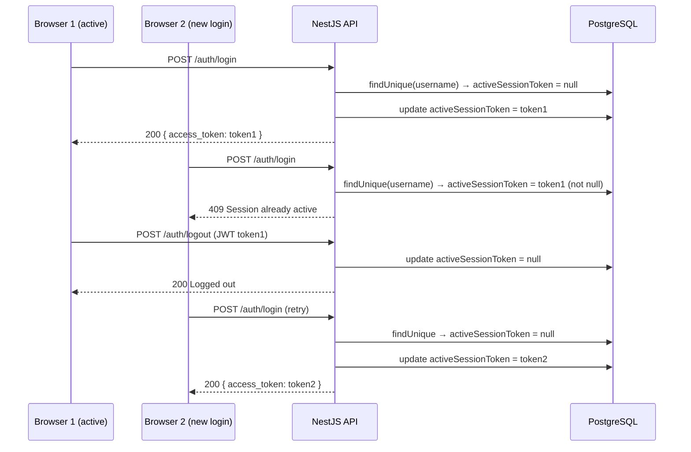

## Context

Currently `AuthService.login()` validates credentials and issues a JWT without checking whether the user already has an active session. `EventsGateway` already maintains an in-memory `userSockets: Map<number, string>` (userId → socketId) that tracks connected clients and clears on `disconnect`, but this map is not consulted during HTTP login. The result: the same user can hold two valid JWTs simultaneously from different browsers/devices, causing dual presence in Socket.IO rooms and inconsistent real-time state.

The fix must be minimal, deployable with a single migration, and must not break the existing Socket.IO presence tracking.

## Goals / Non-Goals

**Goals:**
- Reject a login attempt when the user already has an active session token stored.
- Clear the active session on explicit logout (`POST /api/auth/logout`).
- Clear the active session automatically when the Socket.IO connection for that token disconnects (with a fixed 30 s grace period to tolerate page refreshes).
- Surface a user-friendly 409 error on the frontend login page (i18n).

**Non-Goals:**
- Forcing logout of the existing session from the new device (policy: reject, not kick).
- Rate-limiting login attempts (separate concern).
- Redis / external session store — DB column is sufficient for the current scale.
- Mobile clients or non-browser platforms.

## Decisions

### Decision 1 — Session tracking via DB column on User

**Choice:** Add `activeSessionToken String? @map("active_session_token")` to the `User` model.

**Rationale:** No new infrastructure. PrismaService is already a global singleton. A nullable column is cleared to `null` on logout/disconnect. Reading it on login is a single `findUnique` call (already done). The alternative (in-memory Map on AuthService) would not survive process restart; Redis would add infra overhead not justified at current scale.

**Drawback:** Every login/logout adds one extra DB write. Acceptable given login frequency.

---

### Decision 2 — Reject, not kick, on concurrent login

**Choice:** If `user.activeSessionToken` is non-null on login, throw `ConflictException` (HTTP 409).

**Rationale:** Kicking the existing session (invalidating the old token) creates a worse UX: the first user gets silently logged out mid-session. Rejection with a clear message is simpler and preserves the in-progress session.

---

### Decision 3 — Grace-period timeout on Socket.IO disconnect

**Choice:** On `EventsGateway.handleDisconnect`, schedule session clearance after 30 000 ms (`DISCONNECT_GRACE_MS = 30_000`) via `setTimeout`. If the same user reconnects within the window (socket re-registers via `register-user`), cancel the pending timeout.

**Rationale:** Browser page refreshes fire `disconnect` + immediate reconnect. A zero-delay clear would lock users out after a refresh. 30 s covers page refreshes, brief network drops, and short tab switches while still releasing the session slot within a reasonable time after a genuine tab close.

**Implementation sketch:**
```
private disconnectTimers: Map<number, ReturnType<typeof setTimeout>> = new Map();

handleDisconnect(client: Socket):
  find userId from userSockets
  schedule: setTimeout(() => authService.clearSession(userId), TIMEOUT)
  store in disconnectTimers

handleConnection / register-user:
  if disconnectTimers.has(userId): clearTimeout + delete
```

---

### Decision 4 — Logout endpoint

**Choice:** Add `POST /api/auth/logout` (JWT-guarded) that calls `authService.clearSession(userId)` and returns `{ message: 'Logged out' }`.

**Rationale:** The frontend currently clears localStorage and redirects without hitting the server. A server-side logout is now required to release the active session slot.

---

### Decision 5 — No `beforeunload` localStorage wipe on the frontend

**Choice:** Remove the `beforeunload` handler that was clearing localStorage and sending a logout beacon on tab close.

**Rationale:** Clearing localStorage in `beforeunload` also fired on page refresh (F5), forcing the user to re-authenticate after every reload — an unacceptably aggressive UX. Session release is now handled entirely server-side via the Socket.IO disconnect grace period (Decision 3). When a user closes a tab their socket disconnects; after 30 s the server clears `activeSessionToken`, allowing another browser to log in. The localStorage token persists on the client so that a page refresh reconnects seamlessly without a forced login.

---

## Data Model

```prisma
model User {
  // ... existing fields ...
  activeSessionToken String? @map("active_session_token")
}
```

Migration name: `add_active_session_token_to_user`

---

## API Changes

### POST /api/auth/login (modified)

**Request** (unchanged):
```json
{ "username": "string", "password": "string" }
```

**Response 200** (unchanged):
```json
{ "access_token": "...", "user": { "id": 1, "username": "...", "role": "COACH" } }
```

**Response 409** (new):
```json
{ "statusCode": 409, "message": "Session already active" }
```

On success, `user.activeSessionToken` is set to the issued `access_token` value.

---

### POST /api/auth/logout (new, JWT-guarded)

**Request**: empty body (userId derived from JWT payload).

**Response 200**:
```json
{ "message": "Logged out" }
```

Sets `user.activeSessionToken = null`.

---

## Socket.IO Impact

No new events. The `disconnect` handler in `EventsGateway` is augmented to call `AuthService.clearSession(userId)` after the grace period. The `register-user` event cancels any pending grace-period timer for that userId.

Room `user:{userId}` and all other rooms are unaffected in protocol.

---

## Sequence Diagram



---

## i18n Keys

| Key | ca.json | es.json | en.json |
|-----|---------|---------|---------|
| `auth.errors.sessionAlreadyActive` | "Ja tens una sessió activa en un altre dispositiu" | "Ya tienes una sesión activa en otro dispositivo" | "You already have an active session on another device" |

---

## Testing Strategy

**Backend (Jest):**
- `auth.service.spec.ts`: add unit tests for:
  - `login` when `activeSessionToken` is non-null → expects `ConflictException`
  - `login` when `activeSessionToken` is null → success, token written to DB
  - `logout` → `activeSessionToken` set to null
  - `clearSession` → `activeSessionToken` set to null
- Mock: `PrismaService.user.findUnique`, `PrismaService.user.update`

**EventsGateway (Jest + spy):**
- Spy on `authService.clearSession`; trigger `handleDisconnect`; advance timers with `jest.useFakeTimers()`; assert `clearSession` called after timeout.
- Assert `clearSession` NOT called if `register-user` fires within grace period.

**Manual QA (doc/Proves_usuari.md additions):**
- Login in Chrome → login same account in Firefox → expect 409 error displayed.
- Login in Chrome → logout → login in Firefox → expect success.
- Login in Chrome → close tab (socket disconnect) → wait 30 s → login in Firefox → expect success.

---

## Risks / Trade-offs

| Risk | Mitigation |
|------|------------|
| Token stored in DB could grow stale if server crashes before clearing (e.g. power loss) | On server startup, run a migration guard or a startup hook that resets all `activeSessionToken` values. Alternatively accept the risk for MVP — users can wait for the 30 s Socket.IO reconnect timeout to expire. |
| Race condition: two login requests arrive simultaneously for the same user | Wrap login check + update in a Prisma transaction with `SELECT FOR UPDATE` equivalent (Prisma `$transaction` or unique constraint approach). For MVP, the window is very small and acceptable. |
| Frontend logout without network clears localStorage but leaves server slot occupied until socket disconnect | Mitigated by: frontend must always call `POST /api/auth/logout` before clearing local state. Interceptor or `AuthContext.logout()` is the single exit point. |

## Migration Plan

1. Add `activeSessionToken String? @map("active_session_token")` to `User` in `schema.prisma`.
2. Run `npx prisma migrate dev --name add_active_session_token_to_user`.
3. Deploy backend (existing sessions have `activeSessionToken = null`; existing users are unaffected and can login normally).
4. No rollback complexity — the column is nullable; dropping it restores previous behavior.

## Implementation Notes (post-implementation)

- **`DISCONNECT_GRACE_MS` is hardcoded** in `events.gateway.ts` as `30_000`. The `SESSION_DISCONNECT_TIMEOUT_MS` env var declared in `.env.example` is not read at runtime — the gateway uses the constant directly. The env var entry is kept for documentation purposes only. To make it runtime-configurable, the gateway would need to read `parseInt(process.env.SESSION_DISCONNECT_TIMEOUT_MS ?? '30000', 10)`.
- **`logout-beacon` endpoint** (`POST /auth/logout-beacon`) and `logoutByToken()` in `AuthService` remain in the codebase. The `beforeunload` frontend handler that called them was removed (Decision 5), making these dead code. Retained for now as harmless; can be cleaned up in a follow-up.
- **Open question resolved:** Grace-period is global (hardcoded), not per-user — acceptable for current scale.
- **Startup hook** to reset stale `activeSessionToken` values on deploy not implemented — accepted risk for MVP.
