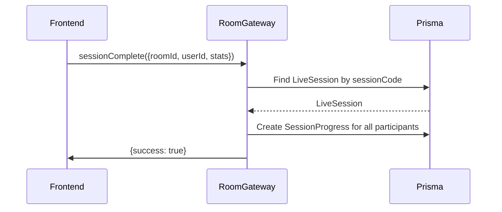

## Context

Currently, Friend Sessions (co-op workout sessions) track progress in-memory via the `RoomGateway` using `roomLastProgress` Map. When a user completes an exercise or updates progress, the data is broadcast via Socket.IO but never persisted to the database. The existing `LiveSession` model stores completion metrics at the session level (completionPercentage, completedSets, completedExercises), but not per-participant.

This means:
- No historical data for individual user progress in Friend Sessions
- Cannot query user statistics across sessions (LW-258 depends on this)
- Progress data is lost when the session ends

## Goals / Non-Goals

**Goals:**
- Add `SessionProgress` Prisma model to persist per-user progress
- Handle `sessionComplete` Socket.IO event in RoomGateway to persist progress
- Support partial progress for abandoned sessions (when a participant leaves early)
- Create Prisma migration for the new model

**Non-Goals:**
- No PR (personal records) tracking
- No physical metrics (heart rate, calories)
- No mobile-specific logic
- No history API endpoints (those are LW-258)
- No modifications to existing LiveSession completion fields (those are for solo/coach sessions)

## Decisions

### 1. New model vs. extending LiveSession

**Decision:** Create a separate `SessionProgress` model instead of extending `LiveSession`.

**Rationale:**
- Friend Sessions have multiple participants, each with their own progress
- The existing LiveSession completion fields work for solo/coach-client sessions where there's one participant
- A separate model allows tracking per-user progress independently
- Easier to query for user-specific statistics in LW-258

### 2. When to persist progress

**Decision:** Persist progress when `sessionComplete` event is received from the client.

**Rationale:**
- The frontend already has a session summary screen (LW-279) that calculates final stats
- The frontend can send the final progress data in the `sessionComplete` payload
- This avoids needing to calculate progress server-side from WorkoutEvents

### 3. Handling abandoned sessions

**Decision:** Persist partial progress when a participant leaves before session completion (host closes room).

**Rationale:**
- Users may want to see partial progress even if they didn't finish
- The `roomLastProgress` Map already stores this data in memory
- When host disconnects (line 73-91 in RoomGateway), we can persist current progress

### 4. Migration strategy

**Decision:** Create migration with `npx prisma migrate dev --name add_session_progress` inside the lw-backend container.

**Rationale:**
- Follows existing pattern in the project
- Migration file will be committed to `src/back/prisma/migrations/`

## Implementation Details

### Prisma Schema Addition

```prisma
model SessionProgress {
  id                 Int       @id @default(autoincrement())
  sessionId          Int       @map("session_id")
  userId             Int       @map("user_id")
  completedExercises Int       @default(0) @map("completed_exercises")
  completedSets      Int       @default(0) @map("completed_sets")
  completionPercentage Float   @default(0) @map("completion_percentage")
  completedAt        DateTime? @map("completed_at")
  isPartial          Boolean   @default(false) @map("is_partial") // true if abandoned

  // Relations
  session LiveSession @relation(fields: [sessionId], references: [id], onDelete: Cascade)
  user    User        @relation(fields: [userId], references: [id])

  @@unique([sessionId, userId]) // One progress record per user per session
  @@map("session_progress")
}
```

### Socket.IO Event Handler

```typescript
@SubscribeMessage('sessionComplete')
async handleSessionComplete(
  @ConnectedSocket() client: Socket,
  @MessageBody() payload: {
    roomId: string;
    userId: string;
    completedExercises: number;
    completedSets: number;
    completionPercentage: number;
  },
) {
  // 1. Find LiveSession by sessionCode (roomId)
  // 2. Create SessionProgress record for each participant
  // 3. If host closing early, mark as partial for remaining participants
}
```

### Migration Name
`add_session_progress`

### Existing Code to Modify
- `src/back/src/room/room.gateway.ts` - Add `sessionComplete` handler
- `src/back/prisma/schema.prisma` - Add `SessionProgress` model

## Risks / Trade-offs

| Risk | Impact | Mitigation |
|------|--------|------------|
| Duplicate progress on re-send | Data integrity | Use `@@unique([sessionId, userId])` - Prisma will reject duplicates |
| Host closes before progress sent | Missing data | On host disconnect, check `roomLastProgress` and persist any existing data |
| Frontend doesn't send complete event | No data persisted | Document that frontend must emit `sessionComplete` before leaving |

## Mermaid Diagram



## Testing Strategy

- **Jest unit**: Test `RoomGateway.handleSessionComplete` with mocked PrismaService
- **Manual QA**: Complete a Friend Session and verify rows exist in `session_progress` table via Adminer