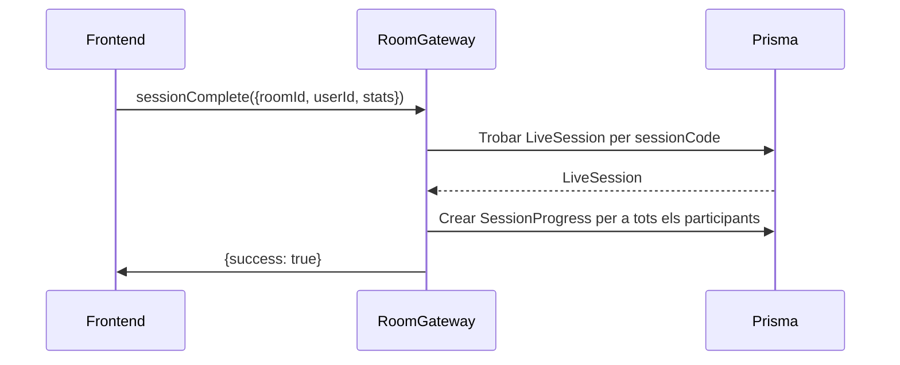

## Context

Actualment, les Friend Sessions (sessions d'entrenament cooperatiu) fan seguiment del progrés en memòria via el `RoomGateway` usant el Map `roomLastProgress`. Quan un usuari completa un exercici o actualitza el progrés, les dades es transmeten via Socket.IO però mai es persisteixen a la base de dades. El model `LiveSession` existent emmagatzema les mètriques de compleció a nivell de sessió (completionPercentage, completedSets, completedExercises), però no per participant.

Això significa:
- No hi ha dades històriques del progrés individual dels usuaris en Friend Sessions
- No es poden consultar estadístiques d'usuari entre sessions (LW-258 depèn d'això)
- Les dades de progrés es perden quan la sessió acaba

## Objectius / Fora d'abast

**Objectius:**
- Afegir el model Prisma `SessionProgress` per persistir el progrés per usuari
- Gestionar l'event Socket.IO `sessionComplete` a RoomGateway per persistir el progrés
- Suportar el progrés parcial per a sessions abandonades (quan un participant marxa aviat)
- Crear la migració Prisma per al nou model

**Fora d'abast:**
- Cap seguiment de PRs (marques personals)
- Cap mètrica física (freqüència cardíaca, calories)
- Cap lògica específica de mòbil
- Cap endpoint d'API d'historial (aquells són LW-258)
- Cap modificació als camps de compleció existents de LiveSession (aquells són per a sessions en solitari/coach)

## Decisions

### 1. Model nou vs. estendre LiveSession

**Decisió:** Crear un model `SessionProgress` separat en lloc d'estendre `LiveSession`.

**Raonament:**
- Les Friend Sessions tenen múltiples participants, cadascun amb el seu propi progrés
- Els camps de compleció existents de LiveSession funcionen per a sessions en solitari/coach-client on hi ha un sol participant
- Un model separat permet fer seguiment del progrés per usuari de forma independent
- Més fàcil de consultar per a estadístiques específiques d'usuari a LW-258

### 2. Quan persistir el progrés

**Decisió:** Persistir el progrés quan es rep l'event `sessionComplete` del client.

**Raonament:**
- El frontend ja té una pantalla de resum de sessió (LW-279) que calcula les estadístiques finals
- El frontend pot enviar les dades de progrés finals en el payload de `sessionComplete`
- Això evita haver de calcular el progrés al servidor a partir de WorkoutEvents

### 3. Gestió de sessions abandonades

**Decisió:** Persistir el progrés parcial quan un participant abandona abans de completar la sessió (l'amfitrió tanca la sala).

**Raonament:**
- Els usuaris potser volen veure el progrés parcial tot i no haver acabat
- El Map `roomLastProgress` ja emmagatzema aquestes dades en memòria
- Quan l'amfitrió es desconnecta (línies 73-91 a RoomGateway), es pot persistir el progrés actual

### 4. Estratègia de migració

**Decisió:** Crear la migració amb `npx prisma migrate dev --name add_session_progress` dins del contenidor lw-backend.

**Raonament:**
- Segueix el patró existent al projecte
- L'arxiu de migració es commitarà a `src/back/prisma/migrations/`

## Detalls d'implementació

### Addició a l'schema Prisma

```prisma
model SessionProgress {
  id                 Int       @id @default(autoincrement())
  sessionId          Int       @map("session_id")
  userId             Int       @map("user_id")
  completedExercises Int       @default(0) @map("completed_exercises")
  completedSets      Int       @default(0) @map("completed_sets")
  completionPercentage Float   @default(0) @map("completion_percentage")
  completedAt        DateTime? @map("completed_at")
  isPartial          Boolean   @default(false) @map("is_partial") // true si abandonada

  // Relacions
  session LiveSession @relation(fields: [sessionId], references: [id], onDelete: Cascade)
  user    User        @relation(fields: [userId], references: [id])

  @@unique([sessionId, userId]) // Un registre de progrés per usuari per sessió
  @@map("session_progress")
}
```

### Gestor d'events Socket.IO

```typescript
@SubscribeMessage('sessionComplete')
async handleSessionComplete(
  @ConnectedSocket() client: Socket,
  @MessageBody() payload: {
    roomId: string;
    userId: string;
    completedExercises: number;
    completedSets: number;
    completionPercentage: number;
  },
) {
  // 1. Trobar LiveSession per sessionCode (roomId)
  // 2. Crear registre SessionProgress per a cada participant
  // 3. Si l'amfitrió tanca aviat, marcar com a parcial per als participants restants
}
```

### Nom de la migració
`add_session_progress`

### Codi existent a modificar
- `src/back/src/room/room.gateway.ts` - Afegir gestor de `sessionComplete`
- `src/back/prisma/schema.prisma` - Afegir model `SessionProgress`

## Riscos / Compensacions

| Risc | Impacte | Mitigació |
|------|---------|-----------|
| Progrés duplicat en reenviar | Integritat de dades | Usar `@@unique([sessionId, userId])` - Prisma rebutjarà duplicats |
| L'amfitrió tanca abans que s'envïi el progrés | Dades que falten | En desconnexió de l'amfitrió, comprovar `roomLastProgress` i persistir les dades existents |
| El frontend no envia l'event de compleció | Cap dada persistida | Documentar que el frontend ha d'emetre `sessionComplete` abans de marxar |

## Diagrama Mermaid



## Estratègia de testing

- **Test unitari Jest**: Testar `RoomGateway.handleSessionComplete` amb PrismaService mockat
- **QA manual**: Completar una Friend Session i verificar que existeixen files a la taula `session_progress` via Adminer
