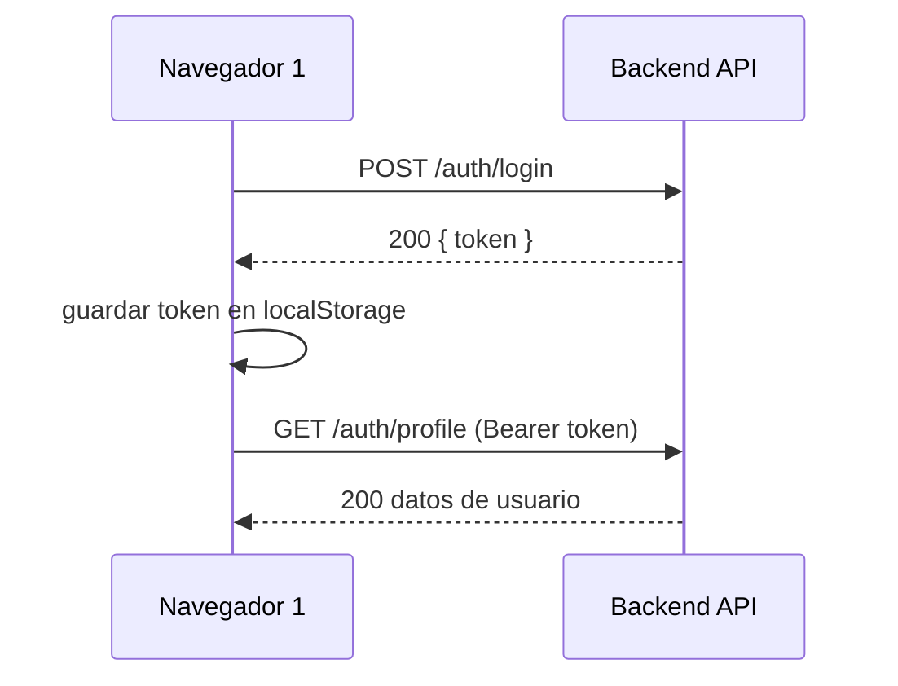
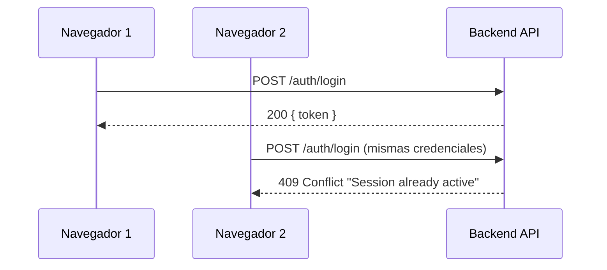
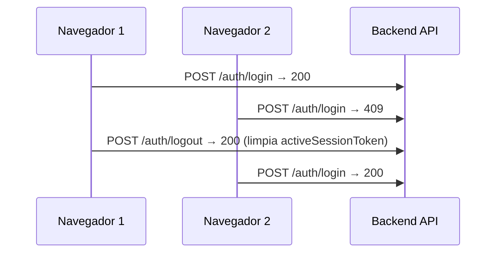
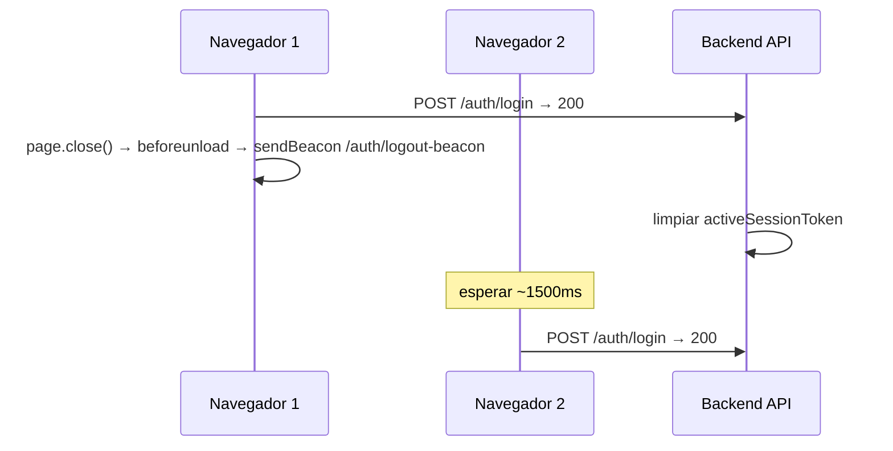
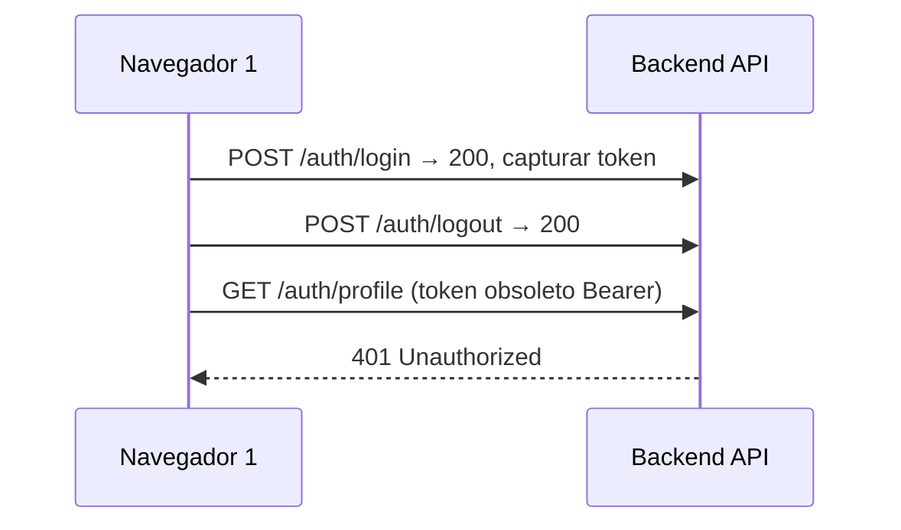

## Contexto

La restricción de sesión única del backend (LW-459) almacena el JWT activo en `User.activeSessionToken`. Al hacer login, rechaza un segundo login con `409 Conflict` si ya existe un token; al hacer logout, limpia el campo. Este cambio agrega tests E2E con Playwright que validan todo este flujo desde la perspectiva del navegador, usando la infraestructura de tests existente (`/testing/reset`, `/testing/login`, contextos duales de navegador, fixture `loginViaApi`).

## Objetivos / No Objetivos

**Objetivos:**
- Cubrir los 5 escenarios de criterios de aceptación de LW-460 con tests Playwright automatizados.
- Reutilizar los fixtures existentes (`freshDb`, `loginViaApi`, `twoContexts`, `LoginPage`) sin modificarlos.
- Ejecutar de forma limpia dentro de la configuración Playwright de un solo worker (sin condiciones de carrera en la BD de tests compartida).

**No Objetivos:**
- Modificar la lógica de restricción de sesión única del backend (ya hecho en LW-459).
- Probar la propagación de desconexión WebSocket (el ciclo de vida de autenticación de Socket.IO está fuera del alcance aquí).
- Pruebas de carga o concurrencia multi-usuario más allá de dos contextos de navegador.
- Agregar nuevos endpoints `/testing/*` — los existentes son suficientes.

## Decisiones

### D1 — Usar `newContext()` para sesiones de navegador independientes

**Decisión**: Cada "segundo dispositivo" es un `browser.newContext()` nuevo con su propio estado de almacenamiento. NO reutilizamos el fixture `twoContexts` (que es para pares coach+cliente) — creamos dos contextos para el **mismo usuario** directamente dentro del test.

**Justificación**: `twoContexts` siempre inicia sesión con roles diferentes. Simular la misma cuenta en dos dispositivos requiere creación manual de contextos. Los contextos de Playwright están completamente aislados (cookies y localStorage separados).

**Alternativa considerada**: Usar dos fixtures `page` separados. Rechazado — comparten el mismo contexto de navegador por defecto en Playwright.

---

### D2 — Login por UI para la sesión primaria, API para la verificación de conflicto

**Decisión**: El primer login usa el helper `LoginPage` (navega a `/login`, rellena el formulario, lo envía). El segundo intento de login concurrente llama a `POST /auth/login` directamente vía `apiRequest` para inspeccionar la respuesta HTTP `409`, en lugar de navegar un segundo navegador a la UI.

**Justificación**: La UI en un login fallido muestra un toast de error traducido, no un estado HTTP. Probar el `409` directamente vía API es más preciso y evita fragilidad alrededor de las cadenas i18n. Para el escenario "segundo navegador UI" (caso de prueba 2b), sí usamos una segunda página para verificar el rechazo a nivel de UI.

**Alternativa considerada**: Conducir ambos logins a través de la UI. Aceptado como test complementario pero no como método de aserción principal.

---

### D3 — El test de timeout/cierre de pestaña usa `page.close()` y espera el beacon logout

**Decisión**: El escenario de limpieza de sesión tras cierre de pestaña cierra la página (disparando `navigator.sendBeacon` → `POST /auth/logout-beacon`), espera brevemente a que el beacon llegue, luego verifica que el segundo login tenga éxito.

**Justificación**: El frontend ya envía un beacon en `visibilitychange`/`beforeunload`. Cerrar una página de Playwright dispara `beforeunload`. Una espera de 1-2s es suficiente ya que el beacon llega a `localhost:3000` en el entorno de tests.

**Riesgo**: La entrega del beacon no está garantizada por especificación. Ver sección de Riesgos.

---

### D4 — La validación `401` usa `apiRequest` con el token obsoleto

**Decisión**: Tras el logout (o invalidación de sesión), capturamos el token antiguo de `localStorage` antes del logout, luego lo enviamos en una cabecera `Authorization: Bearer` a un endpoint protegido y verificamos `401`.

**Justificación**: Esto valida directamente que JwtStrategy rechaza el token (porque `activeSessionToken` ya no coincide o es null). Navegar a una ruta protegida solo nos daría una redirección, no un estado HTTP `401`.

---

## Diagramas de Flujo de Tests

### TC-01: Primer login exitoso



### TC-02: Login concurrente rechazado



### TC-03: Re-login tras logout



### TC-04: Sesión liberada tras cierre de pestaña (beacon logout)



### TC-05: Token obsoleto devuelve 401



---

## Contratos de API Utilizados

### POST /auth/login
```json
Request:  { "username": "e2e_coach", "password": "E2eP@ss123!" }
Éxito:    200 { "access_token": "<jwt>", "user": { "id": 1, "username": "...", "role": "COACH" } }
Conflicto: 409 { "statusCode": 409, "message": "Session already active" }
```

### POST /auth/logout
```json
Headers: Authorization: Bearer <token>
Éxito: 200 {}
```

### POST /auth/logout-beacon?t=<token>
```
Query: t=<raw_token>
Éxito: 200 (o 204)
```

### GET /auth/profile
```json
Headers: Authorization: Bearer <token>
Éxito: 200 { "id": ..., "username": ..., "role": ... }
No autorizado: 401 { "statusCode": 401, "message": "Unauthorized" }
```

---

## Estrategia de Testing

| Escenario | Método | Aserción |
|-----------|--------|----------|
| TC-01: Primer login exitoso | UI Playwright (LoginPage) | Redirige al dashboard, token en localStorage |
| TC-02: Login concurrente rechazado | Llamada directa a API (`request.post`) | HTTP 409, mensaje "Session already active" |
| TC-03: Re-login tras logout | Botón logout Playwright + nuevo login | Segundo contexto llega al dashboard |
| TC-04: Cierre de pestaña libera sesión | `page.close()` + delay + nuevo login | Nuevo login retorna 200 |
| TC-05: Token obsoleto rechazado | Llamada directa a API con token antiguo | HTTP 401 |

**Framework**: `@playwright/test` (ya instalado, `workers: 1`)
**Estado BD**: el fixture `freshDb` resetea antes del bloque describe
**Sin mocks**: todas las llamadas llegan al backend real en `localhost:3000`

---

## Riesgos / Compromisos

| Riesgo | Mitigación |
|--------|------------|
| La entrega del beacon no está garantizada; TC-04 puede ser inestable | Agregar `waitForTimeout(1500)` tras `page.close()`; si sigue siendo inestable, reemplazar con llamada explícita a `POST /auth/logout-beacon` en el test |
| `workers: 1` significa que los tests se ejecutan secuencialmente — cualquier test que no limpie bloquea el siguiente | Cada test usa el fixture `freshDb` que resetea la BD; `afterEach` en TC-02/03 cierra sesión explícitamente de cualquier sesión activa |
| La implementación de `activeSessionToken` podría cambiar (p.ej., moverse a Redis) | Los tests pasan por el contrato HTTP público, no por internos de BD — siguen siendo válidos ante cambios de implementación |
| Timeouts de tests Playwright en CI lento | Mantener timeouts al valor predeterminado de Playwright (30s); las llamadas a `localhost` deberían ser rápidas |

## Preguntas Abiertas

- Ninguna — todo el comportamiento ya está implementado en LW-459. Este cambio es cobertura de tests puramente aditiva.
